class: left top inverse

```{r setup, include=FALSE}
options(htmltools.dir.version = FALSE)
knitr::opts_chunk$set(
  out.width = "100%",
  cache = FALSE,
  echo = TRUE,
  message = FALSE,
  warning = FALSE,
  fig.show = TRUE,
  hiline = TRUE,
  results = "asis"
)
```

```{r, echo=FALSE, include=TRUE}
if (!require(xaringan)) {
  install.packages("xaringan")
  library(xaringan)
}
if (!require(xaringanExtra)) {
  install.packages("xaringanExtra")
  library(xaringanExtra)
}

use_logo(image_url = "./css/Anix-Logo.png", link_url = "https://www.ankitdeshmukh.com/", width = "40px", height = "40px")
use_progress_bar(color = "#ffb14a", location = "top", height = "0.25em")
use_extra_styles(hover_code_line = TRUE, mute_unhighlighted_code = FALSE)
use_xaringan_extra(c("tile_view", "tachyons", "use_logo", "use_progress_bar"))
```

<!-- ------------------------- Start your slides ------------------------- -->

# .gold[Outline:]
## Drones for Data Collection: What They Capture
## Drone Safety & DGCA Regulations
.center[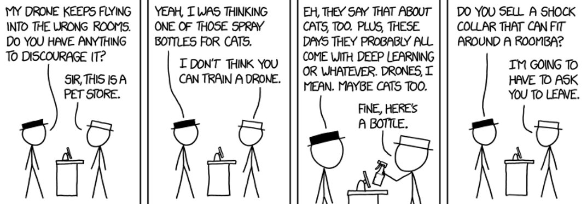]

.footnote[.white[source: ]https://xkcd.com/1881/]

---

class: left top inverse

# .gold[Section 1: Drones for Data Collection]
.pull-left[
### Brief History
- Early military reconnaissance applications
- Expansion into civilian and scientific applications
- Current use in agriculture, hydrology, disaster monitoring, and infrastructure inspection

### What Drones Capture
- High-resolution aerial photographs
- Orthomosaic maps
- Digital Elevation Models (DEM)
- Thermal imagery
- Multispectral and hyperspectral imagery
- Videos for inspection and monitoring
- LiDAR-based terrain information
]

.pull-right[
### Drones and Sensors
- Unmanned Aerial Vehicles (UAVs), commonly called drones, are aircraft systems operated remotely or autonomously.
- Modern drones integrate:
  - GNSS/GPS positioning
  - IMU sensors
  - High-resolution RGB cameras
  - LiDAR sensors
  - Multispectral and thermal sensors
- Drones provide rapid, high-resolution, and cost-effective spatial data acquisition.
]
---

# How the term 'Drone' came?
The term 'Drone' coined from this similarity of flying drone with flying bees sound.
In 1935, British produced a number of radio-controlled aircraft and It's thought that the term 'drone' started to be used at this time, inspired by the name of one of these models, the DH.82B Queen Bee.

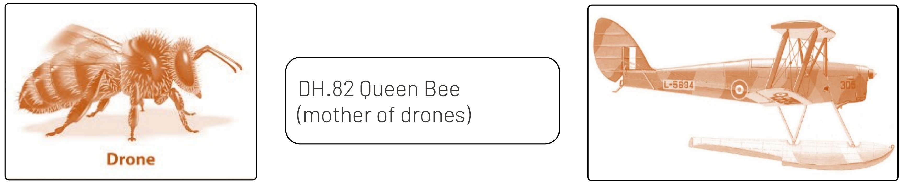

## What is considered as Drone?
1. According to most of the dictionaries .b.green["A Drone is an unmanned aircraft or ship guided by remote control or onboard computers."]
2. "Unmanned aerial vehicles (UAVs) or Drones are aircraft with no on-board crew or passengers. They can be automated 'drones' or remotely piloted vehicles (RPVs)."

---
# Unmanned Aircraft Vehicles (UAV) vs. Drone
.pull-left[
- A drone, formally referred to as an **Unmanned Aircraft Vehicles (UAVs)**
- Under DGCA Drone Rules 2021, is an aircraft capable of operating without an onboard pilot. UAV is the more technical and regulatory term used in research, aviation, and defense.

### A UAS consists of:
- Airframe
- Propulsion system
- Flight controller
- Navigation subsystem
- Communication link
- Payload sensors
- Ground control station
]
.pull-right[
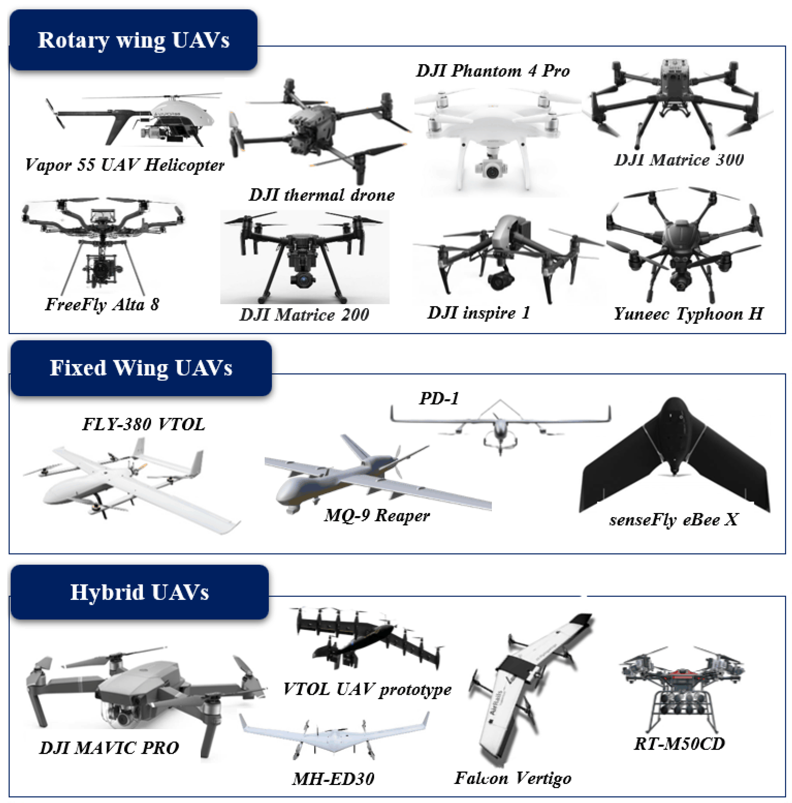
]

.footnote[Image Source: https://design.udlvirtual.edu.pe/]

---

# Basic Characteristics of Drones (UAVs)

- A drone is an unmanned Aircraft, a flying Robot and known as UAV or RPV (Remotely Piloted Vehicles).

- Modern drones use onboard technologies such as **GPS/GNSS, IMU sensors, cameras, and flight-control software** for navigation, stabilization, and data collection.
- UAVs are generally classified into **fixed-wing, rotary-wing, and hybrid VTOL** platforms depending on flight characteristics and application.

- Drone power systems include **Li-Po batteries, gasoline engines, turbine engines, and hybrid-electric systems**, depending on size and operational requirements.

- Drones can be remotely controlled (RC) by Bi-directional radio wave.

- Drones can be as big as 61m wing span and can be as small as less than 1mm.
- Military drones can carry up to 3000kg payloads and fly as high as 18000 m.


- Drones are widely used in **remote sensing, agriculture, hydrology, disaster monitoring, surveying, military reconnaissance, and environmental studies** because they provide high-resolution and flexible data acquisition.

---
# The History of Drone Evolution
.center[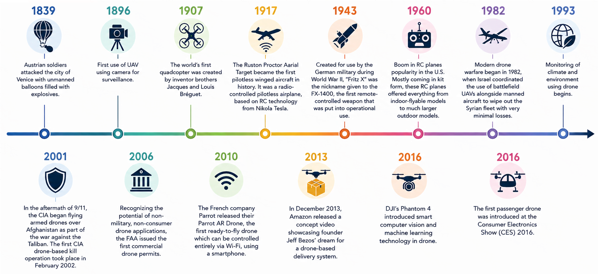]

---

# Classification Of Drone
.center[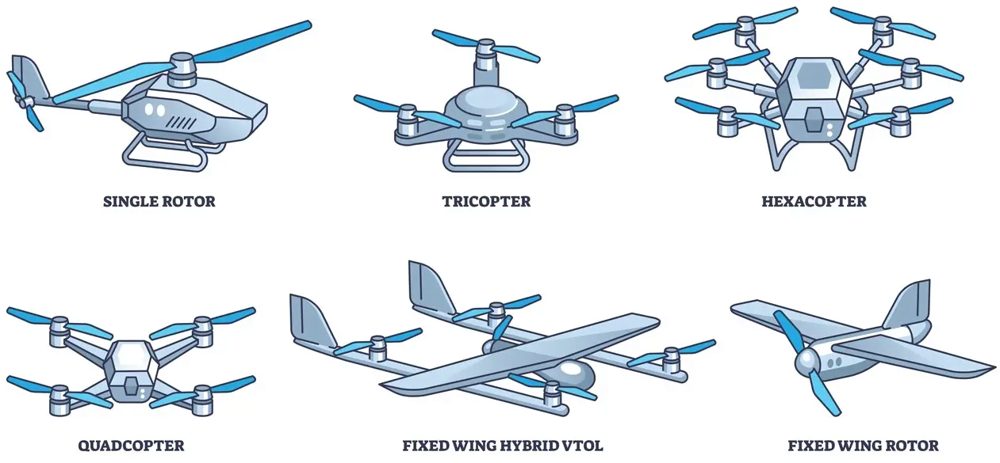]
.footnote[Image Source: https://plant.herdingdonkeys.com/]

---

# The DGCA classifies drones based on weight
.center[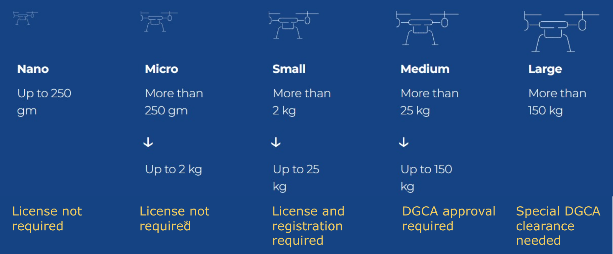]

.f3[The official Indian classification is weight-based, not based on shape or use case.]
---

# Applications Of drones
Ever imagined .blue[a military weapon will become a toy for kids], a tool for photographers or an extreme vehicle for racers?
.center[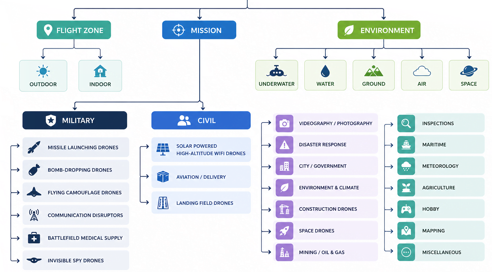]
---

# Why to use drone data

| Domain              | Objective               | Common Outputs             |
| ------------------- | ----------------------- | -------------------------- |
| Agriculture         | Crop stress, yield      | NDVI, plant height         |
| Hydrology           | Flood mapping, erosion  | DEM, orthomosaic           |
| Forestry            | Biomass, canopy density | CHM, tree inventory        |
| Mining              | Volume estimation       | Stockpile calculation      |
| Urban Planning      | Land-use mapping        | 3D city models             |
| Disaster Management | Damage assessment       | Rapid orthomosaics         |
| Infrastructure      | Crack detection         | High-resolution inspection |
| Archaeology         | Site reconstruction     | 3D terrain models          |

---

# Disaster Response After Earthquakes and Floods
.pl-60[
- Drones were used after the 2015 Nepal earthquake to map collapsed buildings, bridges, and other critical infrastructure quickly and accurately.

- UAV imagery helped identify blocked or damaged roads, improving routing for relief vehicles and emergency response.

- Drone‑based photogrammetry enabled rapid damage assessments, including high‑resolution digital elevation models and landslide mapping.

- These data strongly supported rescue‑plan coordination and hazard zoning, demonstrating how drones could transform post‑disaster emergency mapping workflows globally.

.footnote[Data source: ERA5-Land and CHIRPS.]
]

.pr-40[
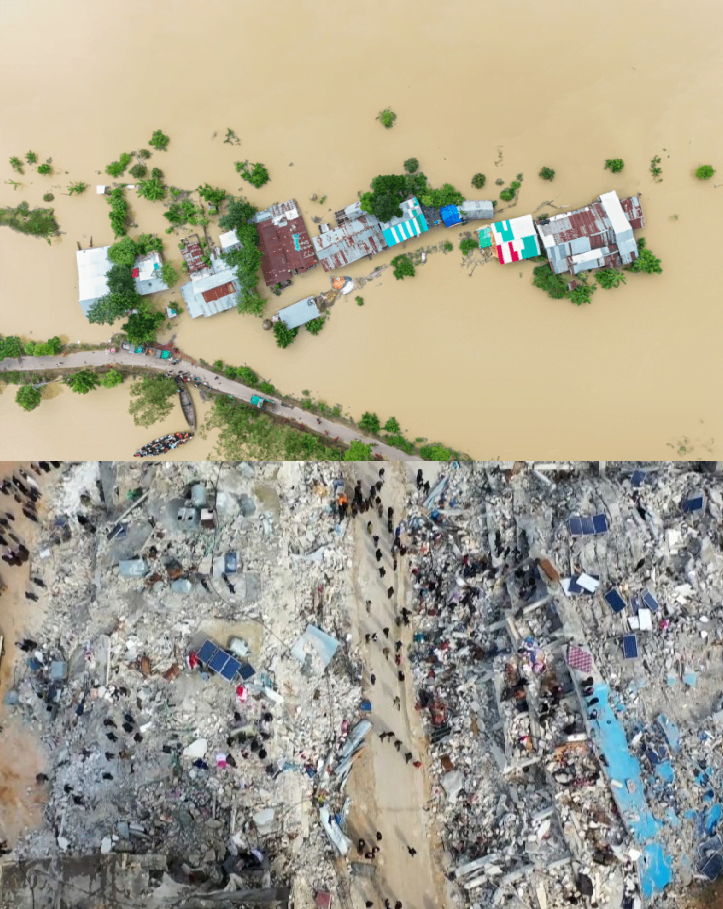
]

---

# Precision Agriculture Revolution
.pl-60[
In a transformative stride towards sustainable agriculture, Kerala-based siblings Devika and Devan Chandrasekharan have pioneered the use of drone technology to enhance farming practices across India. Their startup, Fuselage Innovations, launched in 2020, has introduced drones that significantly increase crop yields while reducing dependency on fertilizers.

- 25-35% increase in crop yield.
- 75% decrease in fertilizer use.
- 8,400 farmers impacted across 4,100 hectares of land.

### Farmers reduced Water use, Fertilizer application, Chemical spraying costs

### While improving yield consistency.
]

.pr-40[
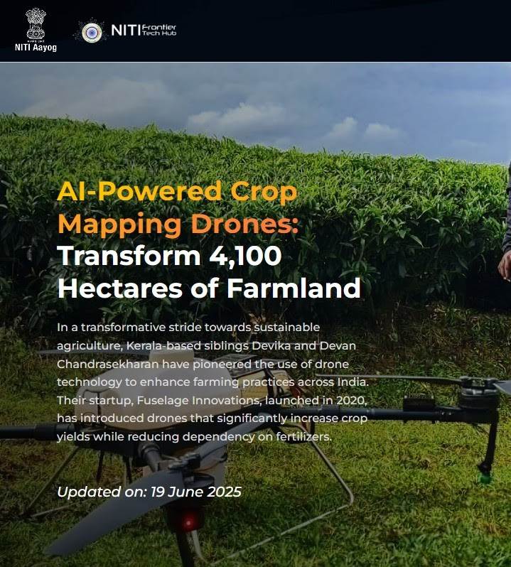
]

---

# Wildlife Conservation in Africa
- Anti-Poaching Operations in countries like Kenya and South Africa, drones were deployed to monitor animal movement,illegal hunting activity, protected forest areas
- Conservation monitoring became cheaper and safer than helicopter-based systems.

.center[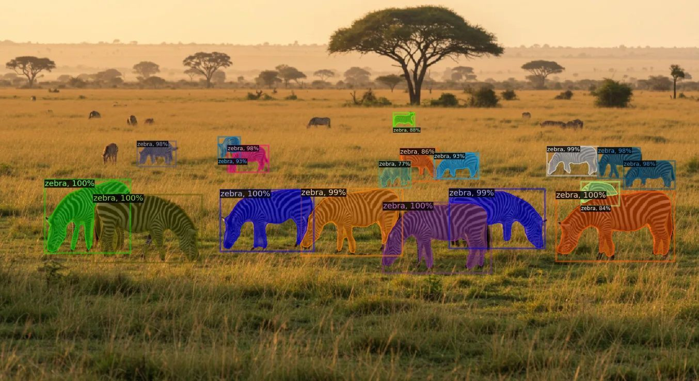]
.footnote[image source: [saiwa.ai](https://saiwa.ai/sairone/blog/drones-for-wildlife-conservation/) ]
---

# Infrastructure Inspection
- Inspection moved from periodic manual surveys to near-real-time monitoring.

- Drones detect cracks and defects on bridges using high‑resolution imagery and thermal sensors.

- UAVs inspect powerlines for corrosion, overheating, and vegetation encroachment without human climbers.

- Drones monitor railway tracks, embankments, and surrounding infrastructure for early signs of damage.

- Drone‑based inspection reduces human risk, lowers costs, and enables near‑real‑time maintenance decisions.

> .f3[Example: Bridge and Powerline Inspection]

---

# Archaeological Discoveries
.pl-60[
- Drones and LiDAR in Guatemala mapped extensive hidden features of **the Ancient Maya civilization**, including ancient roads and causeways buried beneath dense forest canopy.
- UAV surveys revealed numerous previously unknown settlements and small residential sites, greatly expanding the documented extent of Maya occupation.
- High‑resolution data uncovered complex agricultural systems such as terraces, field patterns, and irrigation features, showing large‑scale landscape engineering.
- The discoveries enabled archaeologists to revise models of Maya urbanization, population density, and long‑term land‑use strategies, significantly advancing understanding of ancient Mesoamerican societies.

.footnote[https://lpcazure1.laspositascollege.edu/dronetechnology/arch.php]
]
.pr-40[
.center[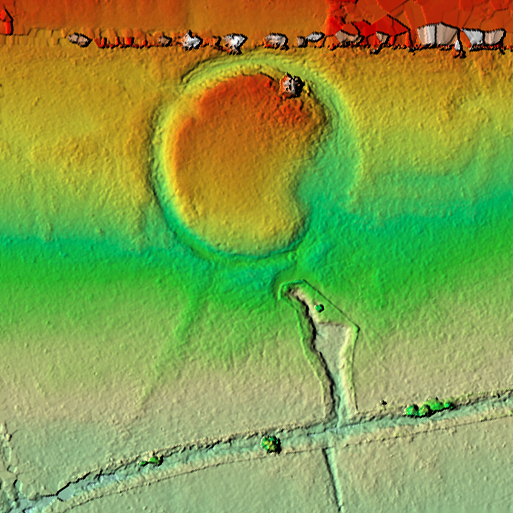]
(Ring Fort as Surface Relief, Ireland 2023 - Castles In Communities)
]

---

# Flood Mapping and Hydrology
.pl-60[
- Rapid aerial mapping of flood extent and depth using high‑resolution imagery and 3D point clouds to support emergency response and evacuation planning.

- Real‑time damage and infrastructure assessment of roads, embankments, buildings, and agricultural fields to quantify losses and prioritize relief and reconstruction.

- Search, rescue, and surveillance using visible and thermal cameras to locate stranded people and monitor inaccessible or dangerous flood‑affected areas.

- Pre- and post-flood monitoring of river channels, drainage networks, and urban landscapes to update flood-risk models, identify vulnerable zones, and inform long‑term resilience planning.
Example: River Monitoring in Europe and Asia

.footnote[Image Source: [whiteoutsolutions.com](https://whiteoutsolutions.com/wp-content/uploads/2024/06/Lyndon-Floodplain-2.png)]
]

.b.purple[High‑resolution **orthomosaics** and **3D point clouds** from drone imagery were integrated into GIS to create detailed flood‑risk and damage maps that guided relief distribution and short‑term recovery planning.
]
.pr-40[.center[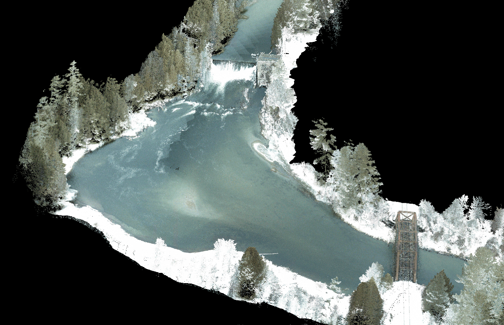]]


---
# COVID-19 Pandemic Response
.pl-70[
During the COVID-19 period, drones were used globally for:
- Drones can help deliver medical supplies, test samples, and other urgent items to hard-to-reach places quickly, which is useful when roads are poor or movement is restricted.
- They can support rapid surveillance and situational awareness by collecting real-time information from difficult or unsafe areas.
- Drone use can reduce turnaround time for health logistics, including transport of COVID-19 samples, which helps speed up testing and response decisions.
- UNICEF frames drones as a practical humanitarian tool, but their use depends on proper coordination with health authorities, civil aviation, and local government systems.

India deploys drones to deliver COVID-19 vaccines
>One real example was Manipur, India, where the ICMR-led i-Drone project delivered COVID-19 vaccines by drone from Bishnupur District Hospital to Karang PHC in less than 15 minutes.

.footnote[Source: [www.who.int](https://www.who.int/india/news-room/feature-stories/detail/india-deploys-drones-to-deliver-covid-19-vaccines)]
]
.pr-30[
.center[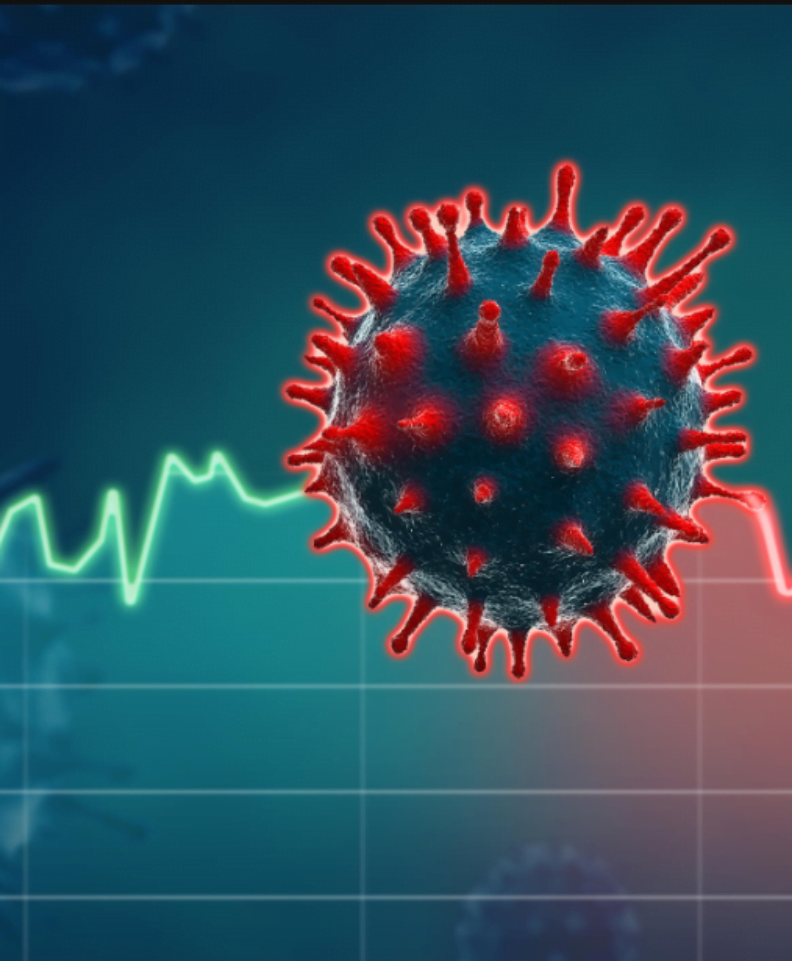]
]

---

# Humanitarian Mapping
.pl-40[
- Organizations such as the United Nations and the Red Cross use drones for refugee camp mapping, post-conflict assessment, and water access analysis.

- These drone-based surveys help humanitarian teams collect fast and accurate geospatial information in hard-to-reach areas.

- As a result, humanitarian logistics and planning become more efficient, targeted, and timely.

]

.pr-60[
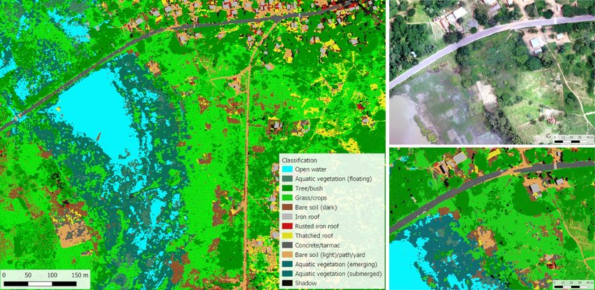
_Drone imagery captured during our 'fact finding' visits to the 'Humanitarian drone testing corridor' in Kasungu district, Malawi. Classification is undertaken using an object-based approach._
]

---
# Drone External Sensor for Data collection
.center[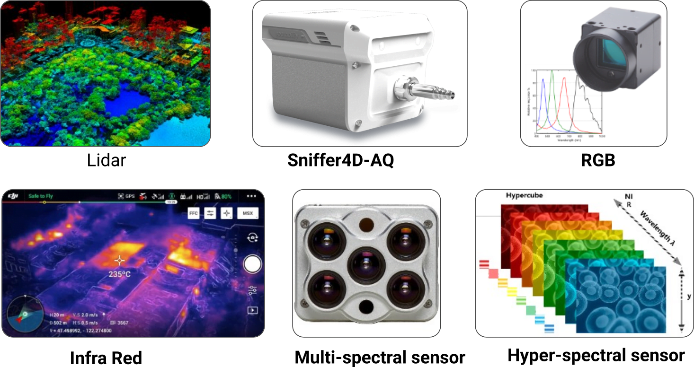]

---

# Principles of Drone-Based Remote Sensing
.pull-left[
- Drone remote sensing acquires **spatial, spectral, temporal, and topographic** information through onboard imaging and ranging sensors.
- It provides ultra-high spatial resolution with flexible revisit capability for site-specific monitoring and rapid deployment.
- Core survey outputs include orthomosaics, point clouds, georeferenced imagery, and elevation surfaces for GIS analysis.
- Typical workflows integrate GNSS geotagging, GCPs, and photogrammetric processing for accurate surface reconstruction.
]
.pull-right[
.center[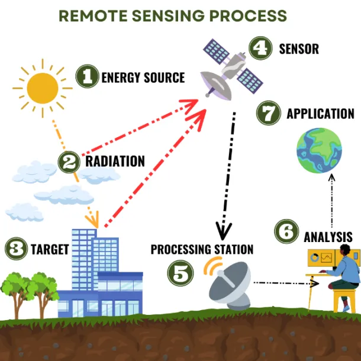]
]

.footnote[Image source: storage.googleapis.com]
---

# What is Photogrammetry
.pull-left[
- Photogrammetry is the technology of obtaining reliable information from photographs.

- Combine several vertical photographs in the block of photography to create a photomosaic.

- Objects can be identified by observing image characteristics such as shape, pattern, tone, and texture .

- The quantitative characteristics of objects such as size, orientation, and position can be determined.

- Photogrammetry is used to create 3D models from photos.
]
.pull-right[

  .center[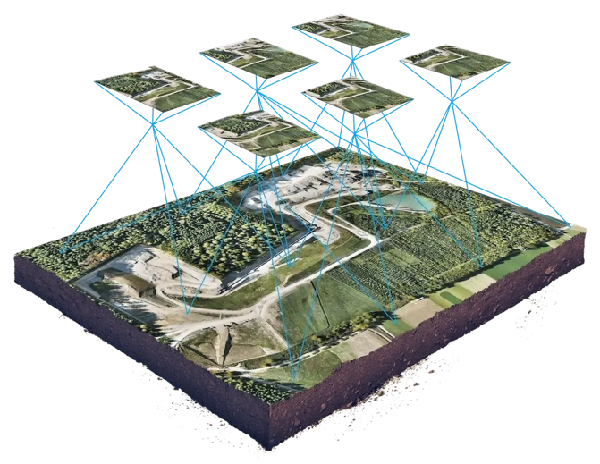]
]

---

# Photogrammetry -> Orthomosaic
.center[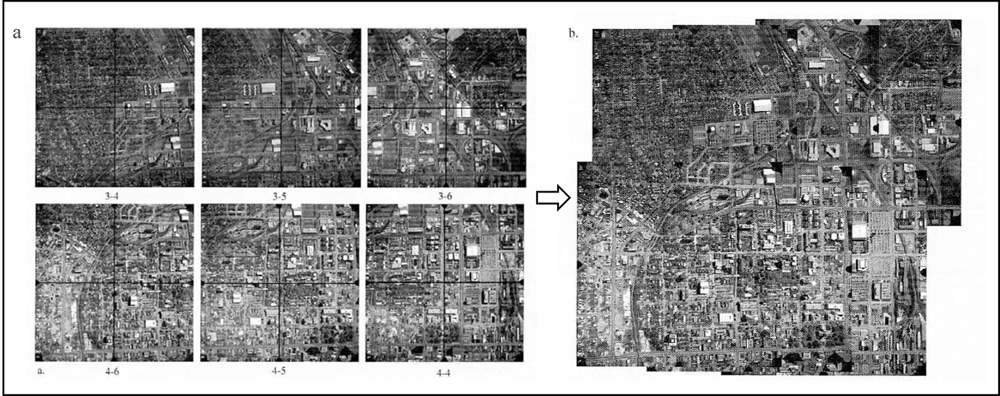]


---
# RGB Photogrammetry
.pull-left[
- RGB sensors capture reflectance in the visible **red, green, and blue** bands.
- Overlapping RGB images are used for orthorectification, orthomosaic generation, and 3D surface reconstruction.
- Common applications include feature extraction, infrastructure mapping, land cover interpretation, and watershed delineation.
- Major limitations include poor spectral separability outside the visible region and sensitivity to illumination changes. [docs.opendronemap](https://docs.opendronemap.org/multispectral/)

.footnote[Image Source: https://guideofgreece.com/]
]
.pull-right[
.center[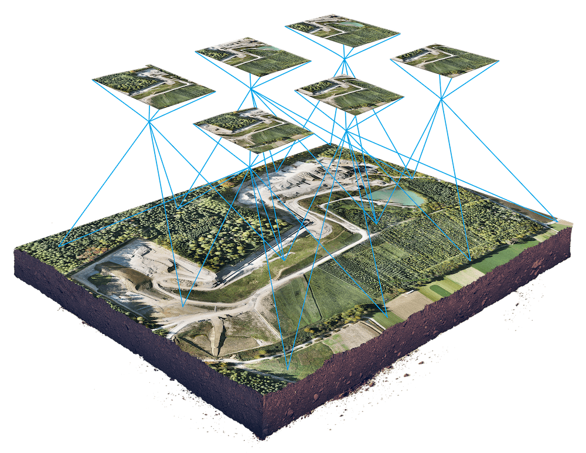]
]
---

# Structure-from-Motion Photogrammetry
.pull-left[
- SfM reconstructs 3D geometry from overlapping images using **feature matching** and image correspondence. [skyebrowse](https://www.skyebrowse.com/news/posts/what-is-photogrammetry)
- The workflow typically includes image acquisition, tie-point extraction, bundle adjustment, sparse cloud generation, and dense reconstruction.
- Final photogrammetric products include dense point clouds, orthomosaics, DSMs, and terrain models.
- Accuracy improves with sufficient image overlap, well-distributed GCPs, and robust camera calibration.

.f3[Surface reconstruction across scales from UAV imagery (1 cm resolution) illustrated for a hillslope. --> ]
]

.pull-right[
.center[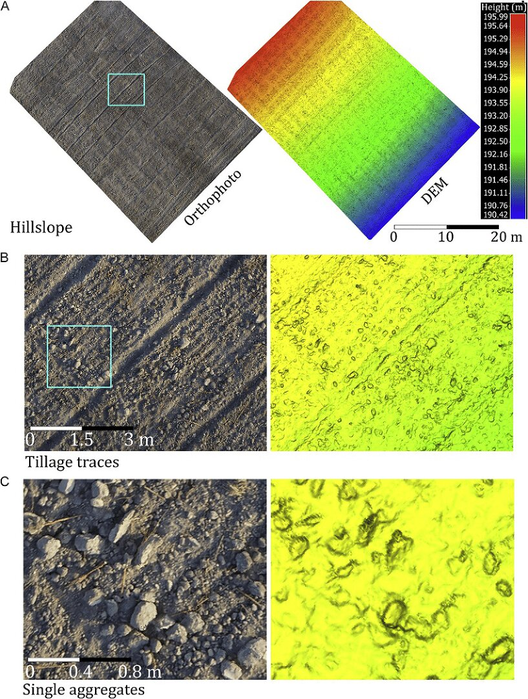]
]
---

# Digital Elevation Models
- A **DSM** represents the elevation of the terrain plus surface objects such as vegetation and buildings.
- A **DTM** represents the bare-earth terrain after removal or filtering of above-ground features.
- DEM-derived products support slope, aspect, flow accumulation, drainage extraction, and floodplain delineation.
- In vegetated terrain, canopy height models can be derived from the elevation difference between DSM and DEM surfaces.

.center[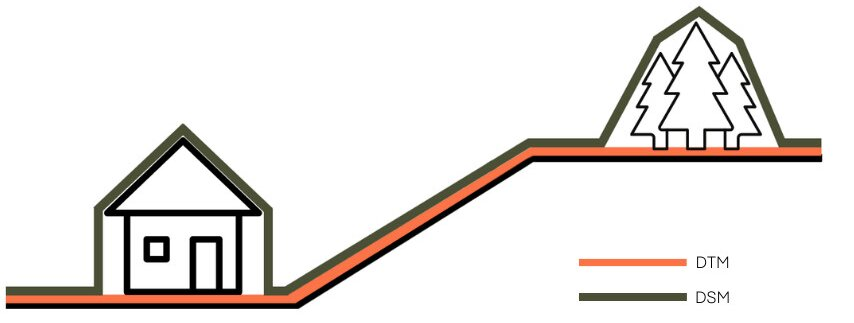]

---

# Multispectral, LiDAR, Thermal Imaging
.pl-30[
- Multispectral cameras capture blue, green, red, red-edge, and near-infrared bands for vegetation and land analysis using indices like NDVI.
- LiDAR uses laser pulse returns to generate 3D point clouds, terrain models, and canopy height measurements.
- Thermal sensors detect long-wave infrared radiation for crop stress monitoring, irrigation management, energy audits, and wildfire detection.

]
.pr-70[
.center[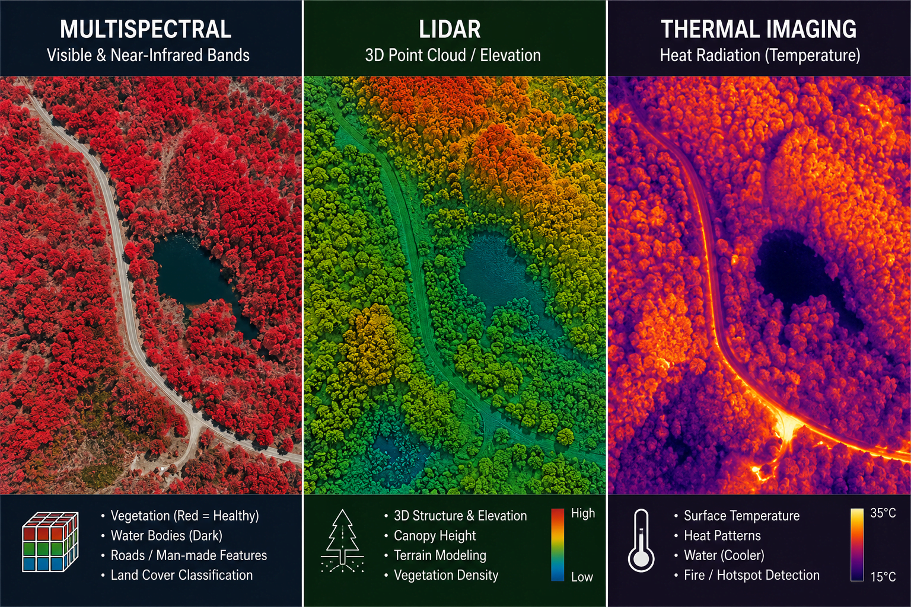]
]
---


# Drone Mission Planning, Errors, and Challenges
.pl-70[
## Mission Planning
- Flight design depends on altitude, overlap, GSD, and UAV speed.
- High image overlap improves 3D reconstruction and point-cloud quality.
- RTK and PPK enable centimeter-level positioning accuracy.
- Ground control software monitors trajectory, waypoints, and flight status.

## Sources of Error
- Geometric errors: lens distortion, motion blur, rolling shutter, low overlap.
- Positional errors: GNSS uncertainty and poor ground control distribution.
- Operational errors: regulatory non-compliance and authorization issues.

## Key Challenges
- Limited battery life restricts coverage and flight duration.
- Data quality depends on stable weather and sensor calibration.
- Airspace regulations and licensing increase operational complexity.
]

.pr-30[
.center[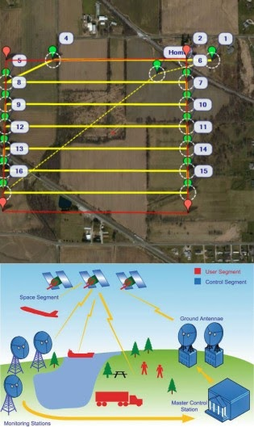]
]

---
## Drone Data Analytics
.pl-30[
- photogrammetry,
- orthomosaic, DTM, DSM,
- point cloud,
- 3D reconstruction,
- geostatistics,
- object detection,
- image segmentation,
- crop classification,
- infrastructure inspection,
- change detection,
- georeferencing,
- feature engineering.
]

.pr-70[
.center[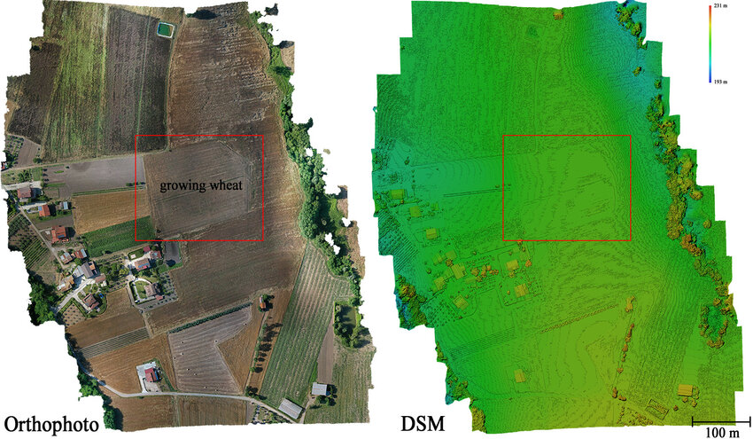]
]
---

# Tools for drone data analysis
.center[]

* Most of Drone data is spatial data. With each image is georeferenced.
* Geospatial analysis technique are required - for that we can use QGIS, R, WebODM etc.

---

# References
- DGCA. (2021). Drone Rules 2021. Government of India.
- Colomina, I., & Molina, P. (2014). Unmanned aerial systems for photogrammetry and remote sensing. ISPRS Journal of Photogrammetry and Remote Sensing, 92, 79-97.
- Turner, D., Lucieer, A., & Watson, C. (2012). An automated technique for generating georectified mosaics from ultra-high resolution UAV imagery. Remote Sensing, 4(5), 1392-1410.

https://www.dgca.gov.in/digigov-portal/?page=jsp/dgca/InventoryList/headerblock/drones/RPAS.html
