class: left top inverse

```{r setup, include=FALSE}
options(htmltools.dir.version = FALSE)
knitr::opts_chunk$set(
  out.width = "100%",
  cache = FALSE,
  echo = TRUE,
  message = FALSE,
  warning = FALSE,
  fig.show = TRUE,
  hiline = TRUE,
  results = "asis"
)
```

```{r, echo=FALSE, include=TRUE}
if (!require(xaringan)) {
  install.packages("xaringan")
  library(xaringan)
}
if (!require(xaringanExtra)) {
  install.packages("xaringanExtra")
  library(xaringanExtra)
}

use_logo(image_url = "./css/Anix-Logo.png", link_url = "https://www.ankitdeshmukh.com/", width = "40px", height = "40px")
use_progress_bar(color = "#ffb14a", location = "top", height = "0.25em")
use_extra_styles(hover_code_line = TRUE, mute_unhighlighted_code = FALSE)
use_xaringan_extra(c("tile_view", "tachyons", "use_logo", "use_progress_bar"))
```

<!-- ------------------------- Start your slides ------------------------- -->

# .gold[Outline:]
## DGCA Regulations in India
## Drone Safety
.center[]

.footnote[.white[source: ]https://xkcd.com/1881/]

---

class: left top inverse
# .gold[DGCA Drone Regulations in India]
.pull-left[
- DGCA and Drone Governance Framework in India
- Drone Rules 2021: Core Legal Structure
- Drone Classification by Weight Category
- Digital Sky Platform, UIN, and Drone Registration
- Remote Pilot Licence (RPL) and Certification Process
- Airspace Zones, Operational Restrictions, and NPNT

.footnote[[Drones Rules, 2021 dated 25 August 2021](https://egazette.gov.in/WriteReadData/2021/229221.pdf)]
]

.pull-right[
.center[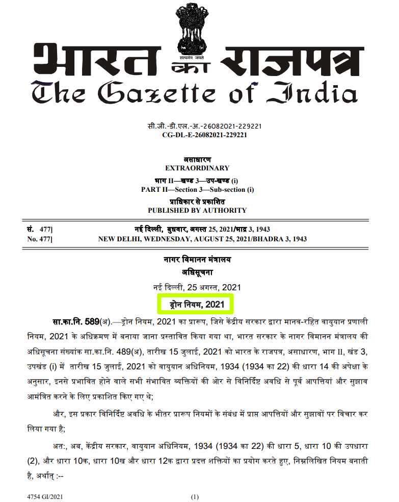]
]

---

# DGCA and Drone Governance Framework in India
* DGCA is the primary aviation regulator under the Directorate General of Civil Aviation responsible for civil drone regulation.

* Drone governance is jointly influenced by:
  * Ministry of Civil Aviation (MoCA)
  * DGCA
  * Airports Authority of India (AAI)
  * Ministry of Home Affairs (MHA)
  * Ministry of Defence (MoD)

* India transitioned from restrictive 2018 RPAS rules to the liberalized Drone Rules 2021 framework.

## Key Regulatory Objectives

* Promote drone ecosystem and manufacturing
* Ensure aviation safety and national security
* Enable commercial drone operations
* Integrate drones into controlled airspace
* Develop drone logistics and UTM ecosystem

---

# Drone Rules 2021: Core Legal Structure
Drone Rules 2021 apply to:
* All civilian unmanned aircraft systems (UAS)
* Weight up to 500 kg
* Recreational, commercial, research, and logistics applications

.center[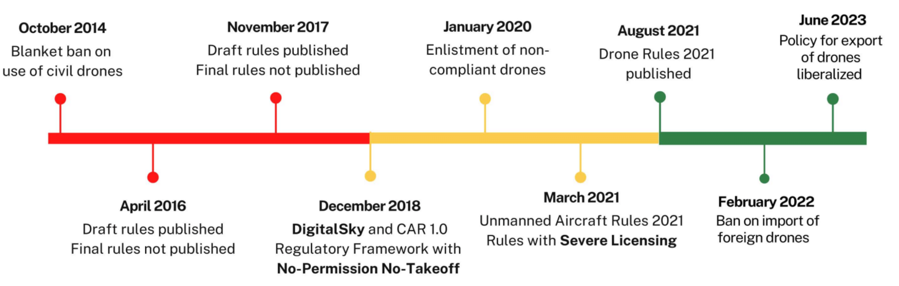]

---

# Drone Rules 2021: Core Legal Structure
## Key Features

* Digital Sky as single-window portal
* Airspace zoning system
* NPNT architecture mandatory
* Reduced operator burden
* Remote pilot licensing framework
* Promotion of indigenous manufacturing

## Important Operational Principles

* Visual Line of Sight (VLOS) mandatory unless specially approved
* Daylight operations preferred
* Airspace permission required depending on zone
* Geo-fencing and real-time tracking encouraged

## Maximum Penalty

* Violations may attract penalties up to INR 1,00,000 under Drone Rules. ([Vikaspedia][2])

---

# Drone Rules 2021: Framework

.center[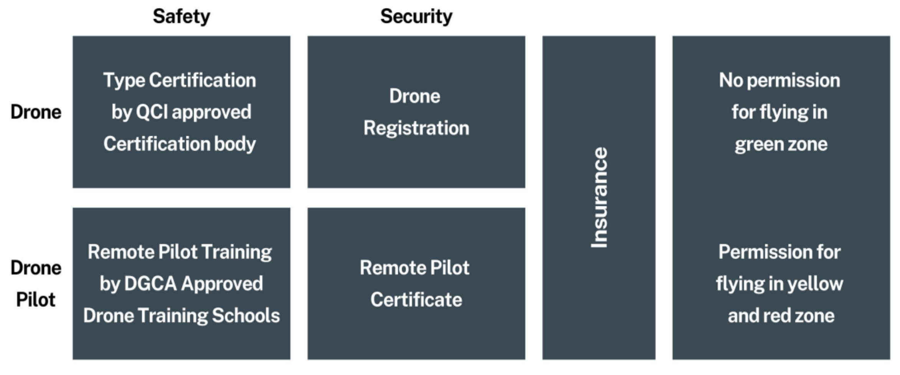]

- Drone operations require regulatory compliance through QCI-certified drone approval, DGCA-approved pilot training, drone registration, and issuance of a Remote Pilot Certificate.

- Operational security is supported through mandatory insurance coverage, with unrestricted access in green zones and prior permission required for flying in yellow and red zones.
---

# Drone Classification by Weight Category
.pl-30[
DGCA classify based on Weight

| Category | Weight Range      |
| -------- | ----------------- |
| Nano     | <= 250 g          |
| Micro    | >250 g to 2 kg    |
| Small    | >2 kg to 25 kg    |
| Medium   | >25 kg to 150 kg  |
| Large    | >150 kg to 500 kg |

.footnote[[legalaffairs.gov.in](https://legalaffairs.gov.in/sites/default/files/Civil%20Aviation%20Regulatory%20Landscape%20of%20Indian%20Drone%20Ecosystem%20red.pdf?trk=public_post-text)]

]
.pr-70[
.center[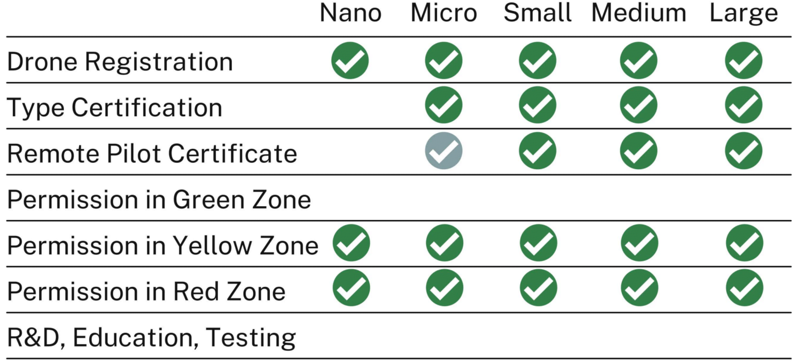]
]
---

# Digital Sky Platform, UIN, and Drone Registration
.pull-left[
**[Digital Sky](https://digitalsky.dgca.gov.in/?utm_source=chatgpt.com) is India's centralized drone governance platform used for:**
* Drone registration
* UIN generation
* Pilot licensing
* Flight permissions

**UIN (Unique Identification Number)**
* Equivalent to vehicle registration number for drones
* Mandatory for most drones except exempted categories

**UIN Linked With**
* Manufacturer serial number
* Flight controller serial number
* Owner details
* Type certificate
]
.pull-right[
**Registration Process**
1. Create Digital Sky account
2. Submit drone specifications
3. Upload required documents
4. Pay registration fee
5. Obtain UIN digitally

**Required Documents**
* Aadhaar/PAN
* GST details (commercial entity)
* Drone serial number
* Type certificate reference
* Manufacturer details

**DAN (Drone Acknowledgement Number)** Temporary acknowledgement issued during transitional regularization schemes
]
---

# Remote Pilot Licence (RPL) and Certification Process
.pull-left[
**Remote Pilot Licence (RPL) is mandatory For**
* Commercial drone operations
* Most drones above nano category
* Professional survey and mapping operations

**Eligibility Criteria**

| Requirement | Criteria           |
| ----------- | ------------------ |
| Minimum age | 18 years           |
| Maximum age | 65 years           |
| Education   | Class 10 pass      |
| Training    | DGCA-approved RPTO |
]
.pull-right[
**Remote Pilot Training Organizations (RPTOs):**DGCA-authorized institutes provide:
* Theory training
* Simulator sessions
* Practical flying
* Emergency procedures
* Airspace awareness

**Training Duration:** ~40 hours total (20 hours theory + 20 hours practical)

**Remote Pilot Certificate (RPC)**
* Issued after passing tests
* Uploaded on Digital Sky
* Licence validity: 10 years
]
---

# Airspace Zones, Operational Restrictions, and NPNT
.pull-left[
**Green Zone**
* No prior permission required
* Allowed up to:
  * 400 ft (120 m) in uncontrolled airspace
  * 200 ft near airports (specific conditions)

**Yellow Zone**
* Controlled airspace
* ATC permission required
* Commonly:
  * 8-12 km around airports
  * Sensitive aviation corridors

**Red Zone**
* Flying prohibited without central government clearance

]
.pull-right[
.center[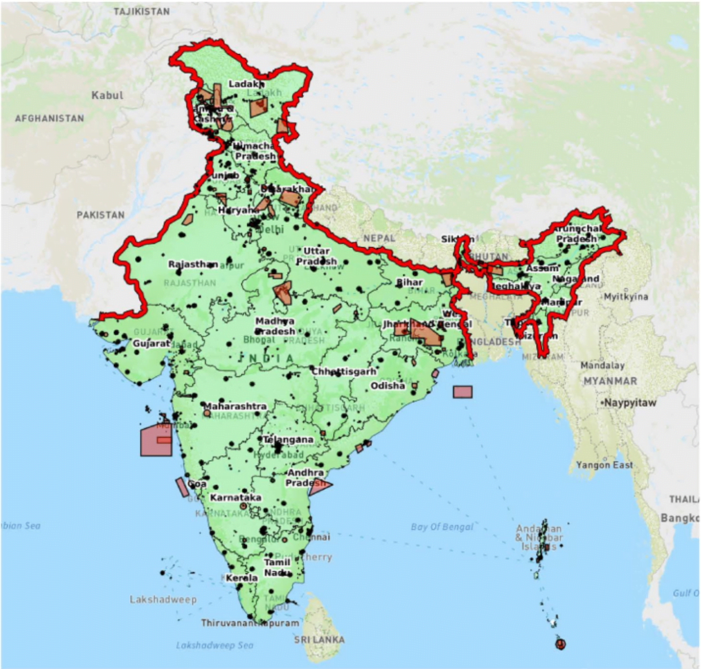]
]

---
# DGCA-Flying Zones Rules
.center[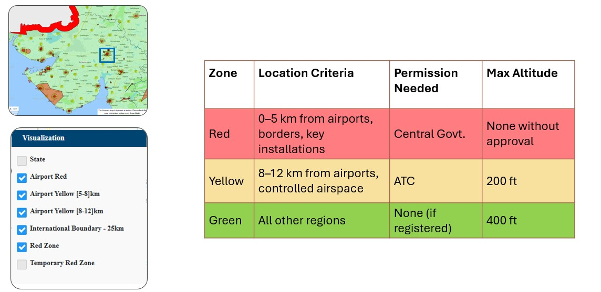]
.footnote[[DigitalSky - Airspace Map](https://digitalsky.dgca.gov.in/airspace-map/#/app)]

---

# Operational Restrictions, and NPNT
.pull-left[
**NPNT - No Permission, No Takeoff**: Drone firmware prevents takeoff without digital authorization.

**NPNT Workflow**
1. Pilot submits flight request
2. Airspace validation performed
3. Digital permission token issued
4. Drone unlocks takeoff capability
]

.pull-right[
**Operational Restrictions**

| Restriction        | Limit                      |
| ------------------ | -------------------------- |
| Maximum altitude   | 400 ft AGL                 |
| VLOS requirement   | Mandatory                  |
| Night operations   | Restricted unless approved |
| Flying over crowds | Prohibited                 |
| Hazardous payloads | Prohibited                 |
]

**BVLOS (Beyond Visual Line of Sight)**
Currently restricted and requires:

* Special DGCA approval
* Experimental corridors
* Safety case submission
* Advanced detect-and-avoid systems
]

---

# DGCA-Flying Zones Rules
.center[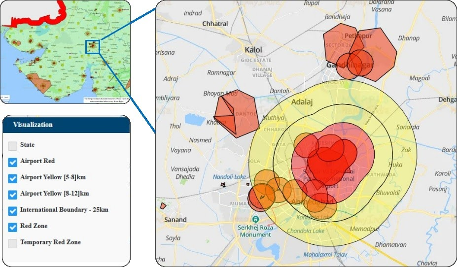]
.footnote[[DigitalSky - Airspace Map](https://digitalsky.dgca.gov.in/airspace-map/#/app)]

---
# Flying Zones at PDEU
.center[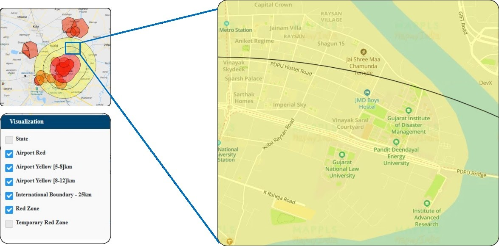]
.footnote[[DigitalSky - Airspace Map](https://digitalsky.dgca.gov.in/airspace-map/#/app)]

---

# PDEU in Outer Yellow zone!
```{r, echo=FALSE}
library(leaflet)
library(sf)

# Ahmedabad Airport coordinates
lon <- 72.6347
lat <- 23.0734

# Create airport point
airport <- st_sfc(
  st_point(c(lon, lat)),
  crs = 4326
)

# Convert to projected CRS for accurate buffering
airport_utm <- st_transform(airport, 32643)

# Create buffers
buffer_5km <- st_buffer(airport_utm, dist = 5000)
buffer_8km <- st_buffer(airport_utm, dist = 8000)
buffer_12km <- st_buffer(airport_utm, dist = 12000)

# Back to WGS84 for leaflet
buffer_5km <- st_transform(buffer_5km, 4326)
buffer_8km <- st_transform(buffer_8km, 4326)
buffer_12km <- st_transform(buffer_12km, 4326)

# Leaflet map
leaflet() %>%
  addTiles() %>%
  # 12 km buffer
  addPolygons(
    data = buffer_12km,
    color = "#361d1a",
    weight = 2,
    fillColor = "#ffe260",
    fillOpacity = 0.2,
    group = "12 km Buffer"
  ) %>%
  # 8 km buffer
  addPolygons(
    data = buffer_8km,
    color = "#361d1a",
    weight = 2,
    fillColor = "#ff8f33",
    fillOpacity = 0.2,
    group = "8 km Buffer"
  ) %>%
  # 5 km buffer
  addPolygons(
    data = buffer_5km,
    color = "red",
    weight = 2,
    fillOpacity = 0.3,
    group = "5 km Buffer"
  ) %>%
  # Airport marker
  addMarkers(
    lng = lon,
    lat = lat,
    popup = "Ahmedabad Airport"
  ) %>%
  addMarkers(
    lng = 72.665031,
    lat = 23.155411,
    popup = "PDEU (You are Here!)",
    icon = makeIcon(
      iconUrl = "https://raw.githubusercontent.com/pointhi/leaflet-color-markers/master/img/marker-icon-red.png",
      shadowUrl = "https://cdnjs.cloudflare.com/ajax/libs/leaflet/0.7.7/images/marker-shadow.png",
      iconWidth = 25,
      iconHeight = 41,
      iconAnchorX = 12,
      iconAnchorY = 41
    ),
  ) %>%
  # Center map
  setView(lng = lon, lat = lat, zoom = 11)
```

---
# DGCA Skymap for Kochi City

<!-- Option 1: Screenshot -->
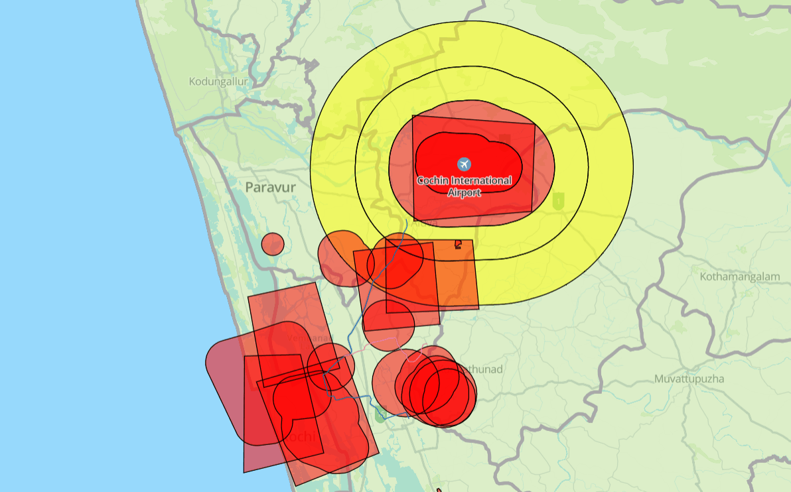

<!-- Option 2: Link -->
[Click here to open the interactive DigitalSky Map](https://digitalsky.aai.aero/digital-sky-map){target="_blank"}

---

# Flying a drone in a restricted or no-fly zones
Flying a drone in a restricted or no-fly zone in India can lead to:
- Monetary fines
- Drone confiscation
- FIR/criminal charges
- Possible imprisonment in serious security-sensitive cases

Under India's drone regulations and related aviation/security laws 2021:
- .red.b.f3[First violations may attract fines up to approximately ₹50,000.]
- .red.b.f3[Repeat or serious violations may increase penalties to ₹1,00,000 and possible imprisonment up to 6 months.]

---
class: left top inverse
# .gold[Drone Safety]
.f3.pull-left[
- Importance of Drone Safety
- Pre-Flight Safety Checklist
- Weather and Environmental Considerations
- No-Fly Zones and Restricted Areas
- Common Causes of Drone Accidents

.footnote[[Drones Rules, 2021 dated 25 August 2021](https://egazette.gov.in/WriteReadData/2021/229221.pdf)]
]

.f3.pull-right[
.center[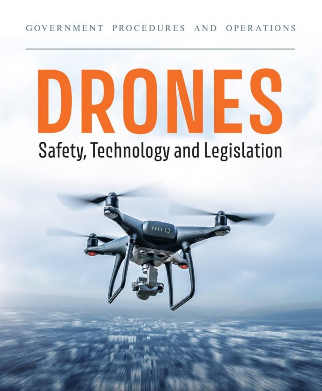]
]

---
# 1. Importance of Drone Safety

- Drone technology is transforming agriculture, surveying, disaster management, filmmaking, and infrastructure monitoring across India. However, even a small operational mistake can cause serious accidents, injuries, or airspace conflicts.

- Safe drone operations protect not only the pilot and equipment, but also people on the ground and nearby aircraft.

- In India, the DGCA Drone Rules, 2021 emphasize responsible flying practices to ensure safe integration of drones into civil airspace. A strong safety culture also improves public trust in commercial drone applications.

---

.pull-left[
# 2. Pre-Flight Checklist
- Every successful drone mission begins before the drone even leaves the ground.
- Pilots should inspect propellers, motors, batteries, GPS connection, and communication systems before takeoff.
- Weather conditions, nearby obstacles, and airspace permissions must also be verified through platforms such as Digital Sky in India.
- A simple pre-flight checklist can prevent common issues like signal loss, unstable flight, or battery failure. Professional operators often treat pre-flight preparation as seriously as the flight itself.
]
.pull-right[

.center[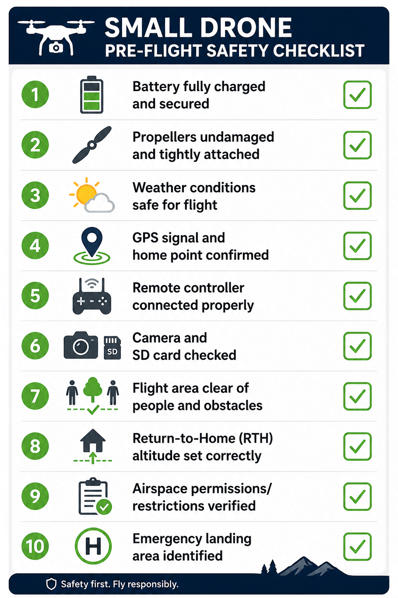]
]

---

# 3. Weather and Environmental Considerations
.pl-30[
  .center[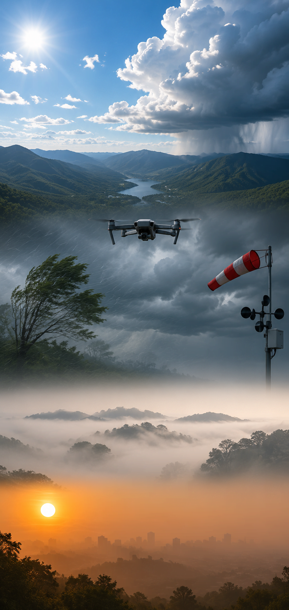]
]

.pr-70[
Weather plays a major role in drone safety, especially in regions with extreme heat, dust, humidity, or monsoon conditions.
- Wind Speed	Affects flight stability; drones can typically handle sustained winds of 10-20 mph. Gusts can destabilize flight paths, especially during takeoff and landing.

- Temperature	Influences battery efficiency and motor performance. Extreme temperatures can shorten battery life and impair signal transmission.

- Precipitation	Can lead to equipment damage and affect visibility. Drones are generally not waterproof unless specifically designed for such conditions.
]

---

# 4. No-Fly Zones and Responsible Drone Use

- Not every location is safe or legal for drone operations.
- Airports, military areas, government facilities, and densely populated urban regions often fall under restricted airspace categories.
- India's Digital Sky platform classifies areas into Green, Yellow, and Red zones to help pilots identify permitted flight regions.
- Responsible drone use also includes respecting privacy and avoiding unnecessary surveillance of people or private property.
- Ethical flying behavior is becoming increasingly important as drone usage expands globally.

---

# 5. Common Causes of Drone Accidents
.pull-left[
- Many drone accidents occur because of avoidable human errors rather than technical failure alone.

- Poor pilot training, ignoring weather conditions, low battery levels, and flying beyond visual line of sight are among the most common causes.

- Urban environments create additional risks due to signal interference, tall structures, and crowded spaces.

- Accident investigations worldwide consistently show that lack of preparation is a major contributing factor.
Developing strong operational discipline is therefore one of the most effective safety measures.
]

.pull-right[
  .center[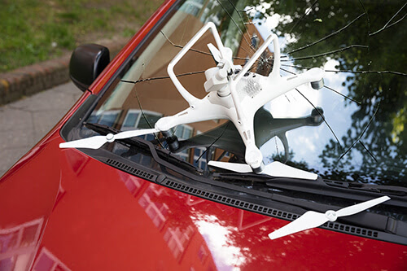]
]

---

# References
- Directorate General of Civil Aviation. (2021). *Drone Rules, 2021*. Government of India.
- International Civil Aviation Organization. (2020). *Manual on Remotely Piloted Aircraft Systems (RPAS)*.
- Federal Aviation Administration. (2023). *Small Unmanned Aircraft Systems Regulations (Part 107)*.
- Finn, R. L., & Wright, D. (2016). Privacy, data protection and ethics for civil drone practice. *Computer Law & Security Review, 32*(4), 577-586.
- Clothier, R., Greer, D., Greer, F., & Mehta, A. (2015). Risk perception and public acceptance of drones. *Risk Analysis, 35*(6), 1167-1183.
- Ministry of Civil Aviation. (2021). Liberalised Drone Rules, 2021. Government of India.
- Digital Sky Platform. (2025). DGCA Drone Governance Portal. Government of India.
- Asteria Aerospace. (2021). India's new drone regulations.
- Anand and Anand. (2021). Drone Rules 2021: Regulatory overview.
- [Regulatory landscape of Indian drone ecosystem](https://legalaffairs.gov.in/sites/default/files/Civil%20Aviation%20Regulatory%20Landscape%20of%20Indian%20Drone%20Ecosystem%20red.pdf?trk=public_post-text)
