class: left top inverse

```{r setup, include=FALSE}
options(htmltools.dir.version = FALSE)
knitr::opts_chunk$set(out.width = "100%", cache = FALSE, echo = TRUE, message = FALSE, warning = FALSE, fig.show = TRUE, hiline = TRUE, results = "asis")
```

```{r, echo=FALSE, include=TRUE}
library(xaringan)
library(xaringanExtra)

use_logo(image_url = "./css/Anix-Logo.png", link_url = "https://www.ankitdeshmukh.com/", width = "40px", height = "40px")
use_progress_bar(color = "#ffb14a", location = "top", height = "0.2em")
use_extra_styles(hover_code_line = TRUE, mute_unhighlighted_code = FALSE)
use_xaringan_extra(c("tile_view", "tachyons", "use_logo", "use_progress_bar"))
```

<!-- ------------------------- Start your slides ------------------------- -->

# .gold[Outline:]
.center[]

---
.pl-40[
# Similarity Between a Camera and Human Vision
- Both human eyes and remote sensing sensors detect reflected energy to observe objects.
- Both identify features based on differences in color, brightness, and patterns.

***

**The energy radiates from an energy source.**
- Passive source - naturally available energy source is the sun.
- Active energy source - such as lamp, a laser, or a microwave transmitter with its antenna.
]
.pr-60[
.center[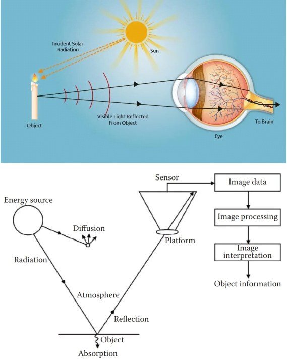]
]

---
# What is Remote Sensing?

.pull-left[
- Remote sensing is obtaining information about an object from a distance.
- .blue[Photography is a very common form of remote sensing.]
- There are different ways to collect data, and different sensors are used depending on the application.
- .blue[Some methods collect ground-based data, others airborne or spaceborne.]

- What information do you need?
- How much detail?
- How frequently do you need the data?
]
.pull-right[
.center[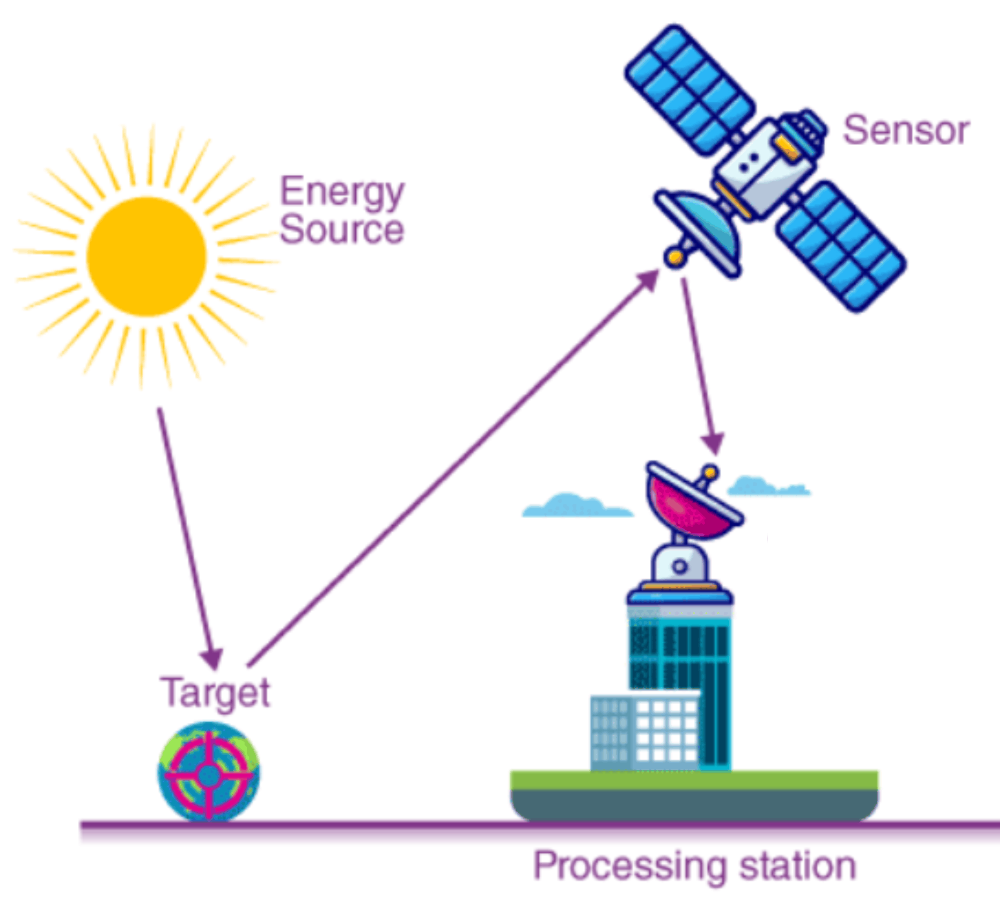]
]
---

# What is Remote Sensing?
.pl-70[
.center[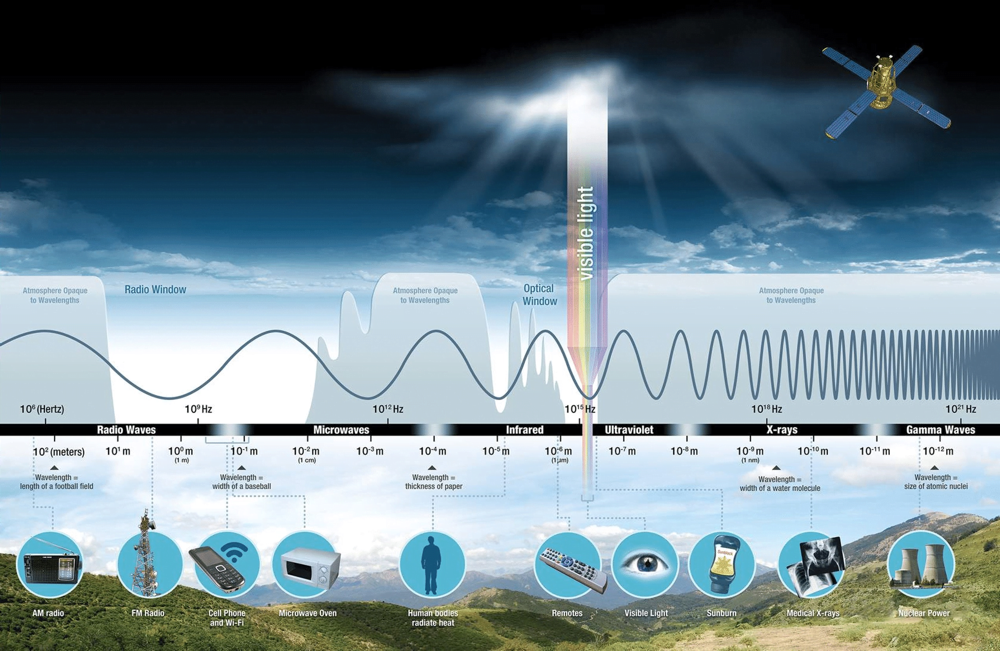]

.footnote[Image source: NASA's Applied Remote Sensing Training Program]
]
.pr-30[
The electromagnetic spectrum is simply the full range of wave frequencies that characterizes solar radiation.

Although we are talking about light, most of the electromagnetic spectrum cannot be detected by the human eye. Even satellite detectors only capture a small portion of the entire electromagnetic spectrum.
]

---
# What is Remote Sensing?
.pl-30[
- Different materials reflect and absorb different wavelengths of electromagnetic radiation.

- You can look at the reflected wavelengths detected by a sensor and determine the type of material it reflected from.  This is known as a spectral signature.

- In the graph on the right, compare the relationship between percent reflectance and the reflective wavelengths of different components of the Earth's surface.

.footnote[Image source: https://mapscaping.com/understanding-spectral-reflectance-in-remote-sensing/]
]

.pr-70[
.center[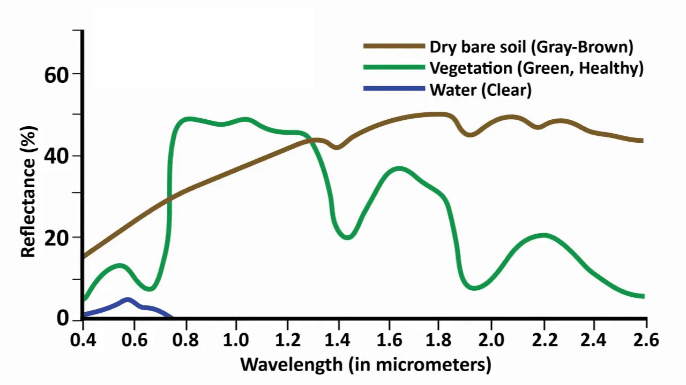]
]

---
# What is Remote Sensing?
.pull-left[
- Electromagnetic radiation travels through the atmosphere two times: first from the Sun to the Earth's surface and then from the surface back to the remote sensing sensor.

- During its passage through the atmosphere, a significant portion of the incoming energy is scattered and absorbed by atmospheric constituents such as gases, water vapor, and aerosols.

- Atmospheric correction techniques are applied to minimize atmospheric scattering and absorption effects, allowing accurate retrieval of surface reflectance that represents true land surface characteristics.
]
.pull-right[
.center[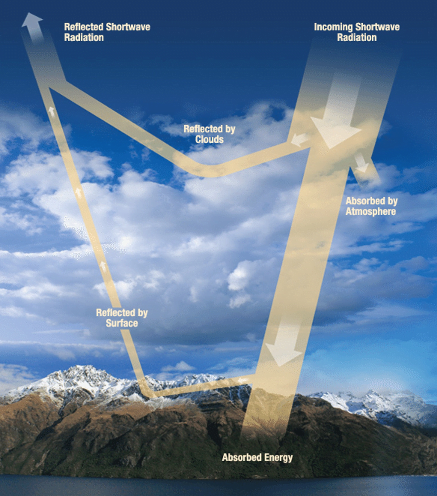]
]

---
# History of Remote sensing
.pl-60[
.center[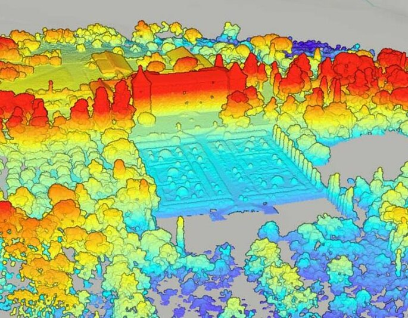]
.footnote[Image Source: https://www.yellowscan.com/knowledge/lidar-point-cloud-basics/]
]
.pr-40[
- Drone-Based Remote Sensing (DBRS) captures very detailed images of the Earth's surface, making it useful for monitoring crops, rivers, soil erosion, and drought conditions at a much finer scale.

- Drones can quickly collect data whenever needed, which helps researchers track changes over time during events such as floods, droughts, or heatwaves.

- By using sensors like multispectral, thermal, and LiDAR cameras, drones can provide valuable information about vegetation health, land surface temperature, and terrain characteristics.
pull-right
]
---

# History of Remote Sensing
.pl-40[
.center[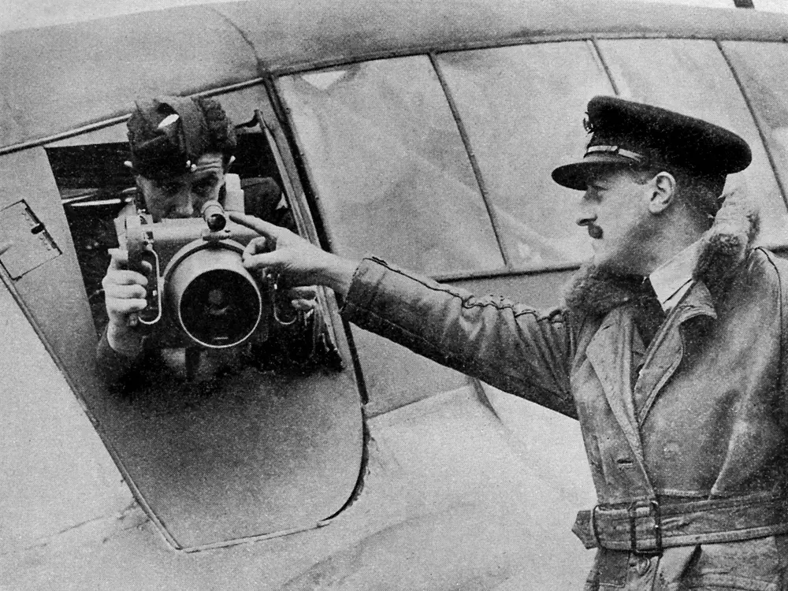]
.center[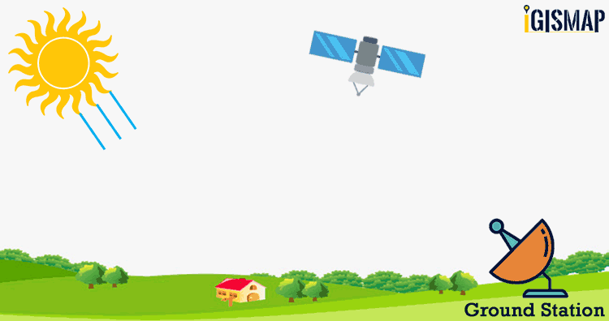]
]
.pr-60[
- **Early Foundations (Pre-1900):** Invention of photography by Louis Daguerre and others in the 1830s-1840s.
- **Aerial Photography Era (1900-1945):** Cameras mounted on Balloons, Kites, Aircraft, etc.
- **Post-War and Electronic Sensor Development (1945-1960s):** After World War II, remote sensing shifted from photographic interpretation toward electronic sensing.
- **Satellite Remote Sensing Revolution (1960s-1980s):** Sputnik 1, Landsat 1
- **Development of Digital Image Processing (1970s-1980s):** Computers enabled pixel-based analysis, Classification algorithm.
- **Microwave and Active Remote Sensing Expansion (1980s-1990s):** SAR- All-weather imaging, Day/night acquisition, Soil moisture estimation.
- **GIS Integration and Global Observation Era (1990s-2010s):** RS increasingly merged with GIS, GPS, Climate modeling.

.footnote[source: https://www.businessinsider.com/]
]

---
# Drone-Based Remote Sensing (DBRS)
Drone-Based Remote Sensing (DBRS) refers to the integration of unmanned aerial vehicles (UAVs), commonly known as drones, with advanced remote sensing sensors for acquiring high-resolution spatial, spectral, and temporal data of the Earth's surface.

Unlike conventional satellite or manned airborne remote sensing, DBRS enables:

- ultra-high spatial resolution data collection,
- site-specific observations,
- on-demand temporal monitoring, and
- cost-effective surveys over localized areas.

---
# Electromagnetic Radiation: Basic Laws
- Electromagnetic energy is radiated by any body having a temperature higher than $-273^\circ\mathrm{C}\ (\text{or }0\ \mathrm{K})$, the absolute zero temperature.
- A body radiates energy in all frequencies. The relation between frequency, $\nu$, and wavelength $\lambda$, is expressible as

$$\lambda = \frac{c}{\nu} $$

.center[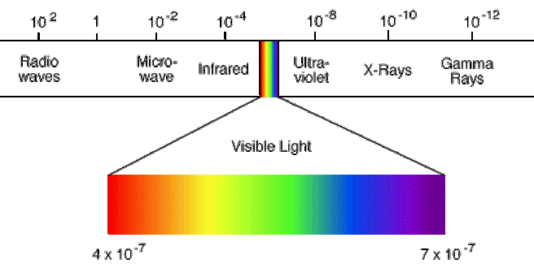]


---
# Electromagnetic Spectrum and Atmospheric Windows
.center[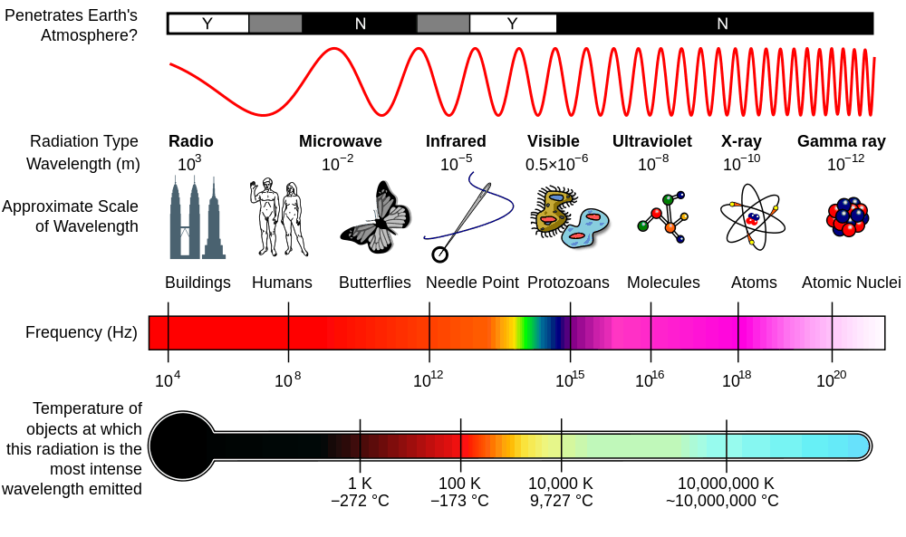]

---
# Energy Interaction with the Atmosphere
.pull-left[
.center[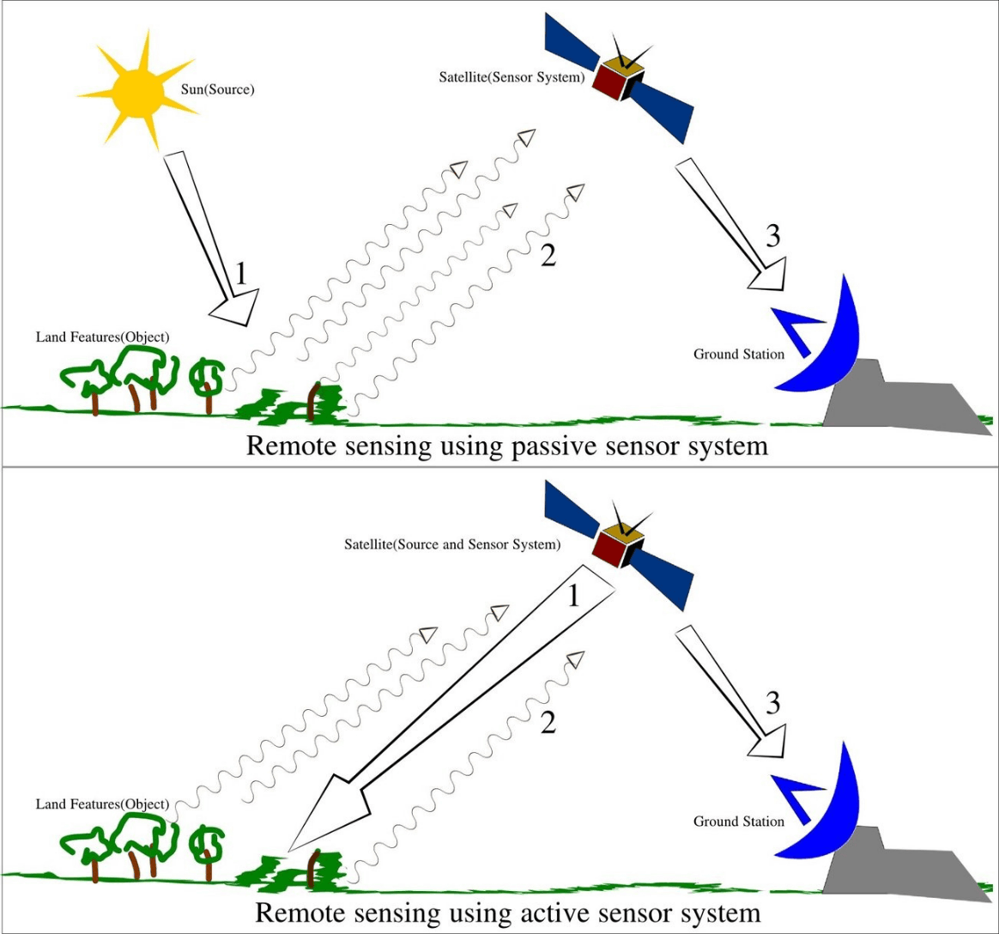]
]
.pull-right[
.f3[Radiation travels through the atmosphere from the source to the sensor.]
- **Path length:** the distance traveled by electromagnetic radiation through the atmosphere.
- Path length varies depending on the remote sensing source and sensing geometry.

**Path length with platforms:**

1. Space-based optical remote sensing using solar radiation: Path length around 2 $\times$ atmospheric thickness (sun to Earth and Earth to sensor).

2. Airborne thermal remote sensing using emitted terrestrial radiation: Path length aprrox. one-way distance from the Earth's surface to the sensor.
]

---
# Electromagnetic Spectrum
.pull-left[
- The Earth continuously interacts with electromagnetic radiation (EMR), and remote sensing is essentially the science of observing these interactions from a distance.

- Satellites/Drones do not "see" the Earth the way humans do - they detect energy across different portions of the electromagnetic spectrum, each carrying unique environmental information.

- You can think of the electromagnetic spectrum as a large scientific library where every wavelength tells a different story about the planet.
]
.pull-right[
- .red[**Visible Region (0.4-0.7 $\mu$m):** The only part detectable by the human eye. Used for natural-color imagery and land-cover mapping.]
- **Near Infrared (NIR) (0.7-1.3 $\mu$m):** Highly sensitive to vegetation health. Healthy plants strongly reflect NIR radiation, which forms the basis of indices such as NDVI.
- **Shortwave Infrared (SWIR):** Useful for detecting moisture stress, soil characteristics, and burned areas.
- **Thermal Infrared (TIR):** Measures emitted radiation related to surface temperature. Widely applied in drought monitoring, evapotranspiration studies, and urban heat analysis.
- **Microwave Region:** Used in radar remote sensing. Microwave signals can penetrate clouds and operate both day and night, making them extremely valuable for all-weather observations.
]
---

# The Atmospheric Window as a Curtain Filled with Holes
.pl-40[
- Not all of the EM spectrum hits the Earth's surface. Atmospheric absorption prevents specific types of EM radiation from passing through the atmosphere.

- Not all of the EM spectrum hits the Earth's surface. Atmospheric absorption prevents specific types of EM radiation from passing through the atmosphere.

.i.b.green[The atmosphere absorbs some wavelengths and allows others to pass, creating atmospheric windows. These windows control how incoming solar radiation and outgoing thermal radiation travel through the atmosphere. The lower panel shows how greenhouse gases and Rayleigh scattering cause this absorption.]

.footnote[Image Source: https://en.wikipedia.org/wiki/Atmospheric_window]

]
.pr-60[
.center[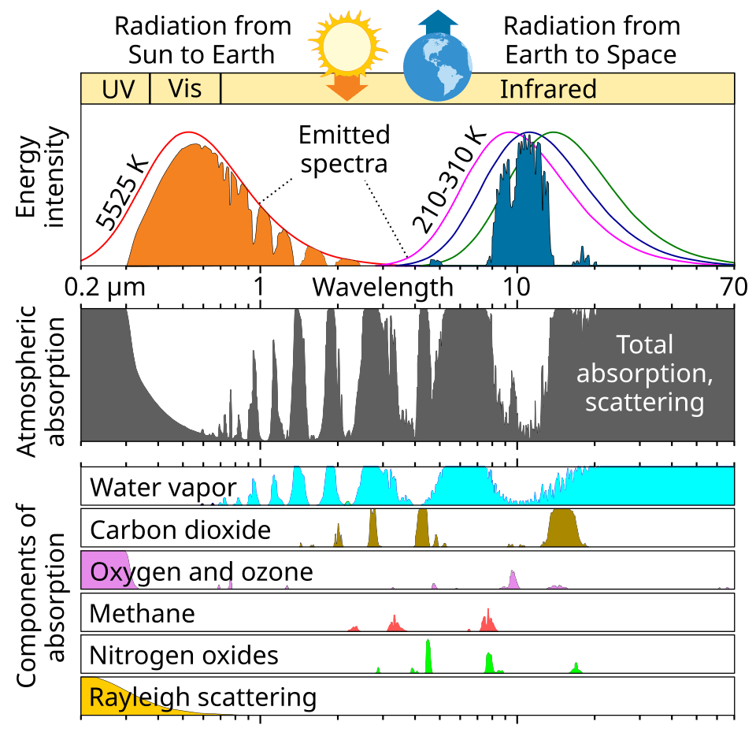]
]

---
# Remote Sensing Platform
.pl-40[
Remote sensing platforms are the carriers or vehicles that hold remote sensing sensors and enable them to collect data from a target area.

Main types of remote sensing platforms:

- Ground-based platforms (tripods, towers, vehicles)
- Airborne platforms (aircraft, drones, helicopters)
- Spaceborne platforms (satellites, space stations)

.footnote[Image: https://www.researchgate.net/figure/arious-platforms-and-sensors-used-for-remote-sensing_fig1_307351403]

]
.pr-60[
  .center[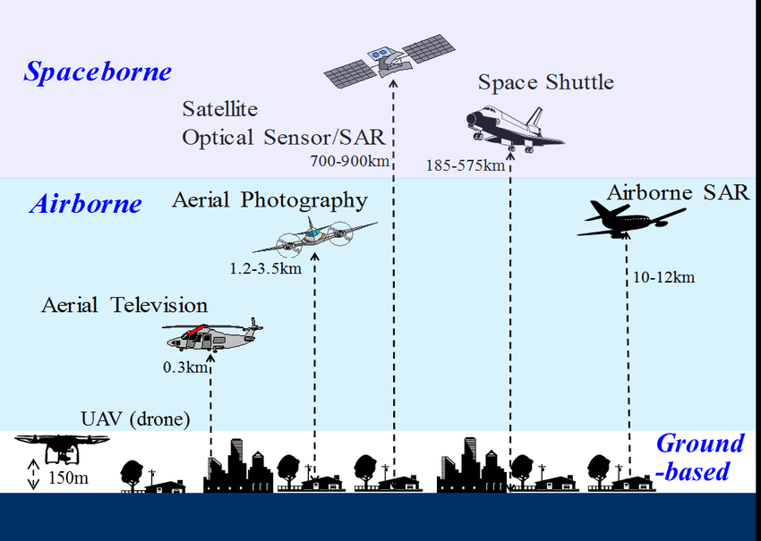]
]
---

# Remote Sensing Sensors
RS sensors are devices that detect and measure electromagnetic radiation reflected or emitted from the Earth's surface.

### Common Drone Sensors
- **RGB cameras** for mapping and visual interpretation
- **Multispectral sensors** for vegetation and crop health analysis
- **Thermal cameras** for temperature and moisture studies
- **LiDAR sensors** for terrain and 3D surface modeling
- **Hyperspectral sensors** for detailed spectral analysis

Advantages
- Very high spatial resolution
- Flexible data acquisition
- Rapid and low-cost surveys
- Suitable for small-area and precision studies

---

.center[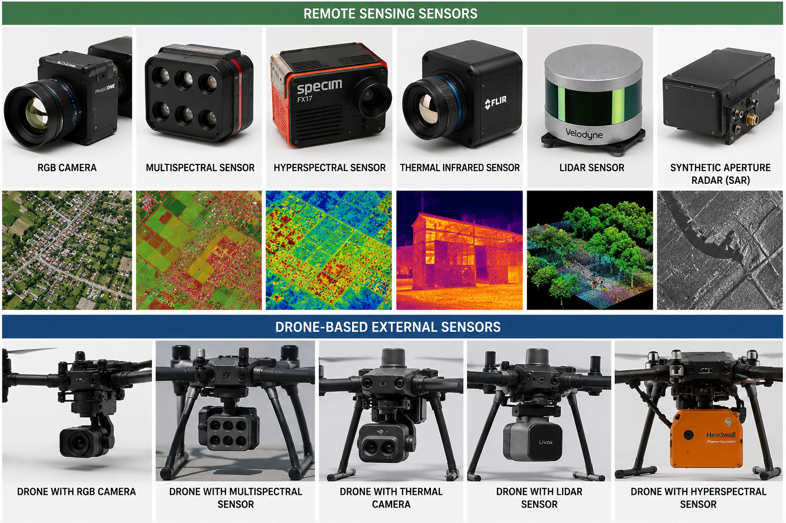]

---
# Different Parameters Of Sensors
In remote sensing resolution means the resolving power:
> Capability to identify the presence of two objects

> Capability to identify the properties of the two objects

***

An image that shows finer details is said to be of finer resolution compared to the image that shows coarser details

Types of Resolution: 4 types of resolutions are defined for the remote sensing systems
1. Spatial resolution (what area and how detailed)
2. Spectral resolution (what colors - bands)
3. Temporal resolution (time of day/season/year)
4. Radiometric resolution (sensitivity of a remote sensor)
---
# Spatial Resolution
- Spatial resolution refers to the clarity of features on the earth surface.
- It is the ability of the sensor to differentiate between various objects and features of the earth surface.
- In simple words, spatial resolution refers to the ratio between size of pixel and the area it represents.

.center[]

One pixel can be attributed to only one color. Therefore, if one pixel in an imagery represents a large area of the land, then the pixel will hide smaller details of that large area.

---
# Spatial Resolution vs. Spatial Extent
A raster at the same extent with more pixels will have a higher resolution (it looks more "crisp"). A raster that is stretched over the same extent with fewer pixels will look more blurry and will be of lower resolution. Source: National Ecological Observatory Network (NEON)

.center[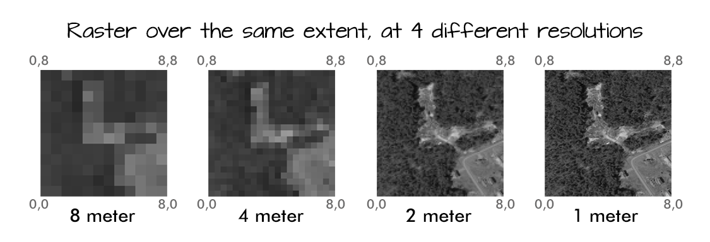]

Generally, the higher the spatial resolution, the less area is covered by a single image.

.footnote[image source: https://www.neonscience.org/resources/learning-hub/tutorials/raster-res-extent-pixels-r]

---
# Spectral Resolution
- Spectral Resolution signifies the number and width of spectral bands of the sensor.
- Typically, multispectral imagery refers to 3 to 10 bands, while hyperspectral imagery
consists of hundreds or thousands of (narrower) bands (i.e., higher spectral resolution).
- Panchromatic is a single broad band that collects a wide range of wavelength
.center[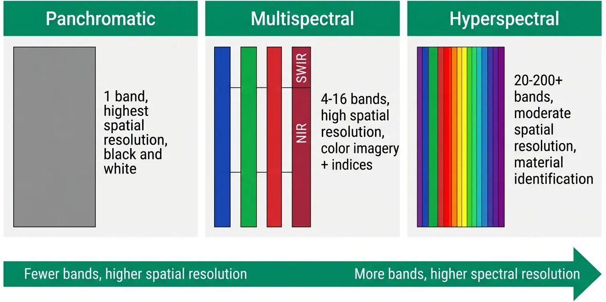]

---
# Temporal Resolution
- Temporal resolution refers to the amount of information available over a given time period.
- The time it takes for a satellite to complete one orbit cycle - also called "revisit time"
- Depends on satellite/sensor capabilities, swath overlap, and latitude
- Temporal resolution is important to understand the direction and amount of change of phenomena in the study area.
- Low temporal resolution data is more suitable for mapping large areas and for applications where changes occur slowly, such as land cover classification and geological mapping.

.center[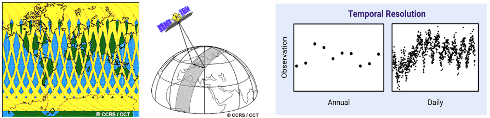]


.footnote[Image credit: [Remote Sensing Tutorials (Natural Resources Canada)](https://natural-resources.canada.ca/maps-tools-and-publications/satellite-imagery-and-air-photos/tutorial-fundamentals-remote-sensing/satellites-and-sensors/satellite-characteristics-orbits-and-swaths/9283)]

---
# Radiometric Resolution
The radiometric resolution indicates the ability of a sensor to distinguish between different intensities within the respective wavelength range of a channel.

Simply speaking, it is the contrast of an image, indicating the number of grayscales - expressed in bits:

$\text{1 bit} = 2^1 = 2 \text{ gray levels}$

$\text{2 bit} = 2^2 = 4 \text{ gray levels}$

$\text{4 bit} = 2^4 = 16 \text{ gray levels}$

$\text{8 bit} = 2^8 = 256 \text{ grayscale levels}$

Radiometric resolution is often described in terms of bit depth, representing the number of bits used to represent pixel values. For example, an 8-bit image has $2^8$ (256) possible values, while a 16-bit image can represent 216 (65,536) values. An 8-bit sensor can distinguish between 256 levels of radiation

An 8-bit image can represent 256 shades of green in a forest, while a 9-bit image can represent 512 shades, allowing finer discrimination between different tree conditions and vegetation health.

---
# Understanding Spectral Reflectance in Remote Sensing
- When working with remote sensing, one key concept to grasp is spectral reflectance.
- .red[This refers to how different surfaces reflect light across various wavelengths of the electromagnetic spectrum.]
- Spectral reflectance curves of three different materials: .b[dry bare soil, green vegetation, and clear water], shown in the figure.

.center[]
---

# Understanding Spectral Reflectance in Remote Sensing

.center[]

.footnote[Lansat Data]
---

.pl-40[
# Spectral Reflectance for vegetation
- Green vegetation exhibits a distinct reflectance pattern. Healthy vegetation appears green because it reflects a significant amount of green light while absorbing more blue and red light. This is crucial for understanding why we perceive vegetation as green.

- Healthy vegetation reflects significantly more in the near-infrared range, which is why remote sensing techniques can effectively detect vegetation health. This capability is particularly useful when analyzing environmental changes or assessing plant health.

.footnote[Image Credit: [mapscaping.com](https://mapscaping.com/understanding-spectral-reflectance-in-remote-sensing/)]
]
.pr-60[
  .center[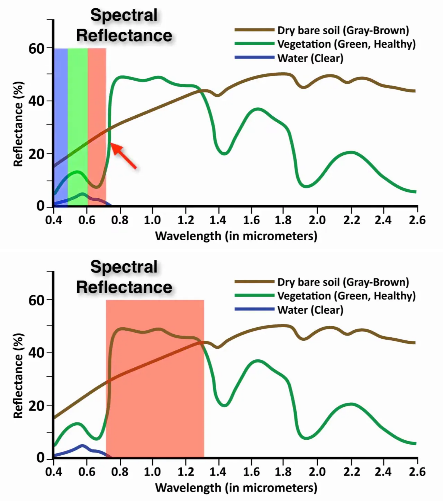]
]
---
# NIR-R-G and RGB composite with Landsat 8 data

.center[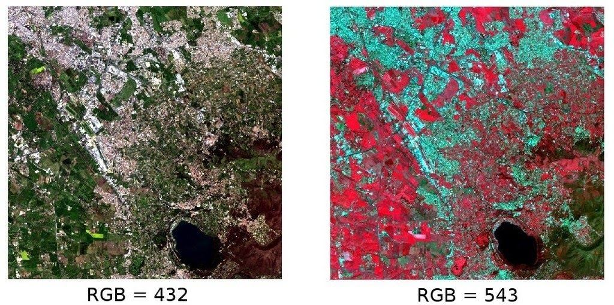]

As you can see, a true color composite image might make it difficult to distinguish between natural grass and astroturf. However, by switching to an infrared band, the differences become clear, as natural vegetation will reflect infrared light differently than synthetic surfaces.

.footnote[Image source: [semiautomaticclassificationmanual](https://semiautomaticclassificationmanual-v5.readthedocs.io/pt/latest/remote_sensing.html)]

---
# Spectral Reflectance Library for RS
- Spectral libraries are used in remote sensing to identify and classify land cover types from satellite or drone imagery.
- They are important for applications such as vegetation analysis, mineral exploration, water quality assessment, and crop monitoring.
- Common spectral libraries include field-measured, laboratory-measured, and satellite-derived spectral datasets.

  - https://gsp.humboldt.edu/olm/Courses/GSP_216/lessons/reflectance.html
  - https://speclib.jpl.nasa.gov/library

---

# Multispectral datasets
Landsat Program provides continuous multispectral Earth observation data for monitoring land use, vegetation, water resources, climate change, and environmental dynamics since 1972.

.center[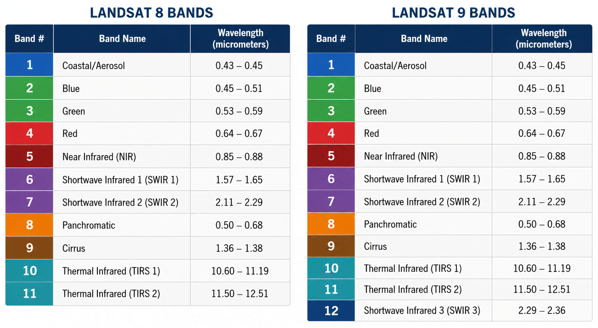]

---
# Spectral Bandpasses for all Landsat Sensors
.center[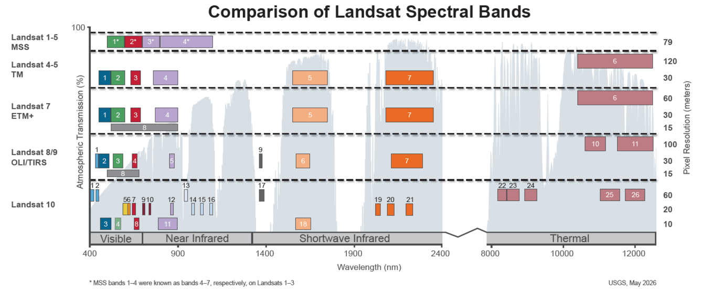]

.footnote[Source: https://www.usgs.gov/media/images/spectral-bandpasses-all-landsat-sensors]
---


---
# Color Composites
### Natural or True Color Composites
True Color Composite (TCC): An RGB image where spectral bands are assigned to match human vision, so features appear in natural colors.
Example for Landsat 8 / Landsat 9:

**RGB = Band 4 (Red), Band 3 (Green), Band 2 (Blue) -> 4-3-2**
***

### False Color Composite (FCC)
False Color Composite (FCC): An RGB image where non-visible bands (commonly Near Infrared or SWIR) are assigned to visible colors to enhance specific surface features such as vegetation, moisture, or urban areas.

Common FCC for vegetation analysis in Landsat 8/9:
**RGB = Band 5 (NIR), Band 4 (Red), Band 3 (Green) -> 5-4-3**

Goto : https://gsp.humboldt.edu/olm/Courses/GSP_216/lessons/composites.html

---
.pl-30[
# FCC: NIR-R-G
Near infrared, red, and green light were used to create this false-color image of Algeria. Red, plant-covered land dominates the scene.

> .red[You can see the vegetation in red colors]

.footnote[NASA image by Robert Simmon with Landsat 8 data from the USGS Earth Explorer.]
]
.pr-70[
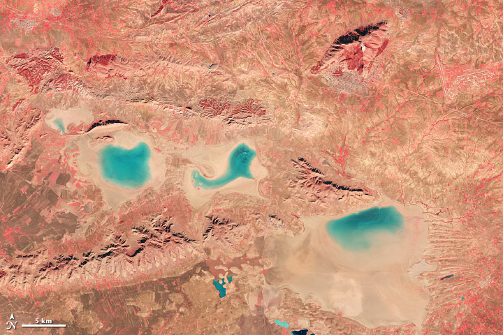
]
---
.pl-30[
## FCC - SWIR-NIR-G
The shortwave infrared, near infrared, and green light version of the Algeria scene highlights the presence of water and wet soil in an otherwise dry landscape.

> .red[This combination shows soil moisture better]

.gray.i[NASA image by Robert Simmon with Landsat 8 data from the USGS Earth Explorer.]
]

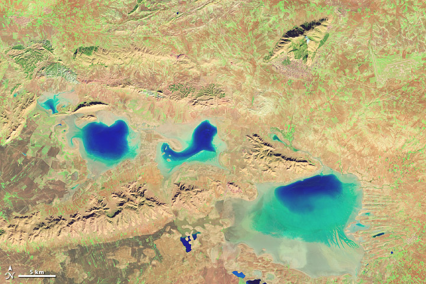
.footnote[For more details read: https://earthobservatory.nasa.gov/features/FalseColor/page6.php]
---

# Spectral change impact on Composition
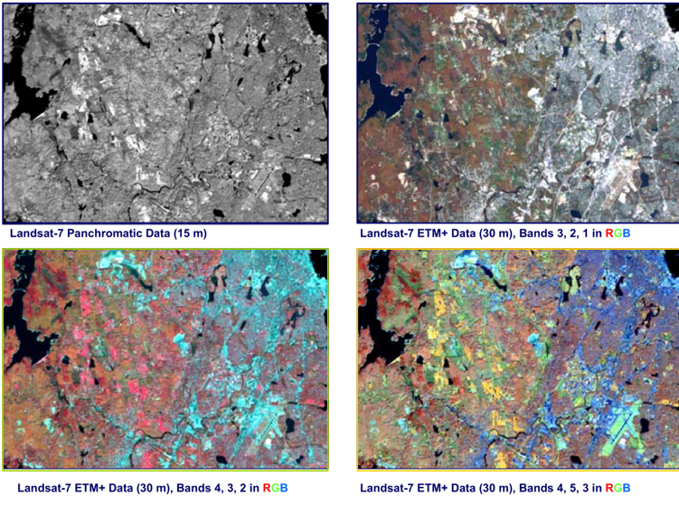

---
# Temporal change impact on Composition
.left-column[
**Time of day/season image acquisition**
- Leaf on/leaf off
- Tidal stage
- Seasonal differences
- Shadows
- Phenological differences
- Relationship to field sampling
- Seasonal Considerations
]

.right-column[
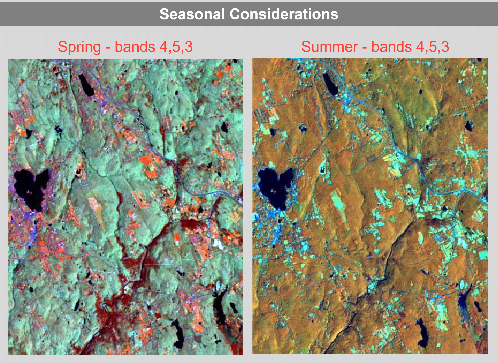
]

---
## Animation shows deforestation and river course change in Assam in the last 3 decades.
.footnote[Source: Raj Bhagat Palanichamy]

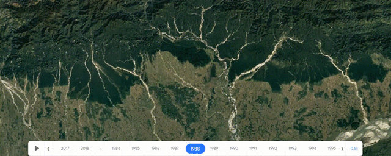

---
# River path change with time
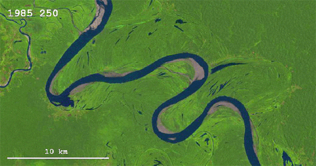

.footnote[Image source: https://sploid.gizmodo.com/]
---

# Normalized Difference Indices (Band Ratios)
It can be used to emphasize certain aspects of the shape of the spectral signatures of different land covers, and;

It can be used to de-emphasize the effects of variable illumination within a scene.

The normalized difference vegetation index: $NDVI = \frac{NIR - RED}{NIR + RED}$

The normalized difference water index version 1: $NDWI1 = \frac{NIR - SWIR1}{NIR + SWIR1}$

The normalized difference water index version 2: $NDWI2 = \frac{GREEN - NIR}{GREEN + NIR}$

The normalized burn ratio: $NBR = \frac{NIR - SWIR2}{NIR + SWIR2}$

The normalized blue-red ratio: $NBRR = \frac{BLUE - RED}{BLUE + RED}$

---
.pl-40[
## Insights from Normalized Difference Indices
.f3[Case study at Ukhma River (Tons Basin) Uttarakhand]
- From 2006-2019 the spatial distribution of higher NDVI decreases, and the lowest NDVI increases.
- The minimum value of NDWI is increased continuously from 2006-2019.

.footnote[Image Credit Dr. Shyam Kanhaiya]
]
.pr-60[
.center[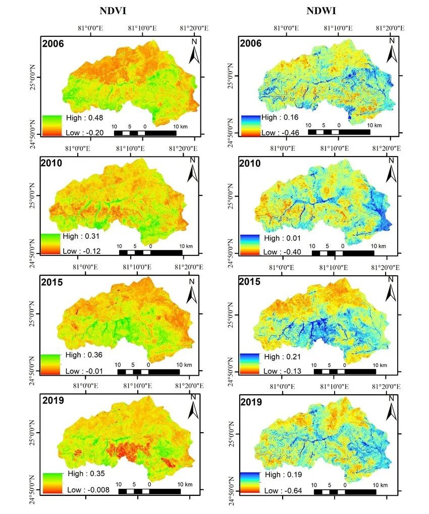]
]
---
# Satellite Data Processing Levels for Landsat products
Satellite data is available at different stages (or levels) of processing, going from raw data
collected from the satellite to polished products that visualize information.

NASA takes the data from satellites and processes it to make it more usable for a broad
array of applications. There is a set of terminology that NASA uses to refer to the levels of
processing it conducts:

- Level 0 & 1 is the raw instrument data that may be time-referenced. It is the most
difficult to use.

- Level 2 is Level 1 data that has been converted into a geophysical quantity through a
computer algorithm (known as retrieval). This data is geo-referenced and calibrated.

- Level 3 is Level 2 data that has been mapped on a uniform space-time grid and
quality controlled.

- Level 4 is Level 3 data that has been combined with models or other instrument data.

- Level 3 & 4 data is the easiest to use.

.footnote[NASA's Applied Remote Sensing Training Program]

---

class: center middle inverse
# .gold[Section 2: Photogrammetry and Digital Image Processing]
---

# What is Photogrammetry
.pull-left[
Photogrammetry is the process of creating accurate 2D measurements or 3D models from photographs. It works by analyzing multiple overlapping images of an object, building, landscape, or scene and calculating the position of points in space.

- .blue[Combine several vertical photographs in the block of photography to create a photomosaic.]
- Objects can be identified by observing image characteristics such as shape, pattern, tone, and texture.
- .blue[The quantitative characteristics of objects such as size, orientation, and position can be determined.]
- Photogrammetry is used to create 3D models from photos.
]

.pull-right[
  .center[]
]
---

# Principles of Photography and Imaging
- A camera is used to capture a photography and this process is called Photography.

--

- Photography, which means "drawing with light," originated long before cameras and light-sensitive
photographic films came into use.

--

- In the 1700s French artists used the pinhole principle as an aid in drawing perspective views of illuminated objects.

--

.center[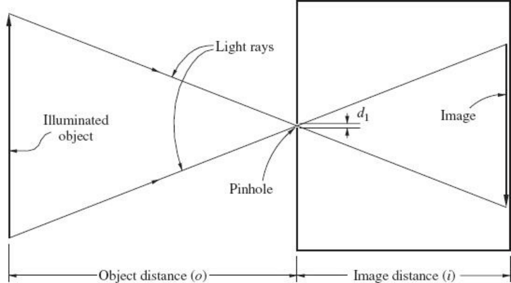]

--

- In 1839 Louis Daguerre of France developed a photographic film which could capture a permanent record of images that illuminated it. By placing this film inside a dark "pinhole box," a picture or photograph could be obtained without the help of an artist.

---
# Principles of Photography and Imaging
- Perhaps the most fundamental device in the field of photogrammetry is the camera. It is the basic
instrument which acquires images, from which photogrammetric products are produced.

--

The traditional imaging device used in photogrammetry is the aerial mapping camera, and its use
is widespread in the photogrammetric industry.

--

The requirements of aerial mapping cameras are quite different from those of ordinary handheld cameras (most DSLRs)
---

# Digital Cameras
.pull-left[
A digital image is a computer-compatible pictorial rendition in which the image is divided into a fine
grid of "picture elements," or pixels.

* Digital imaging devices replace film by using solid-state sensors to convert light intensity into quantified pixel values in a digital image.
* A Charge-Coupled Device (CCD) detects incident light at each pixel location and generates an electric charge proportional to the light intensity.
* The generated charge is amplified, converted into digital form, and arranged in one- or two-dimensional sensor arrays on silicon chips.
* Complementary Metal-Oxide Semiconductor (CMOS) sensors are another type of solid-state image sensor used in some imaging applications alongside CCDs.
]
.pull-right[
  .center[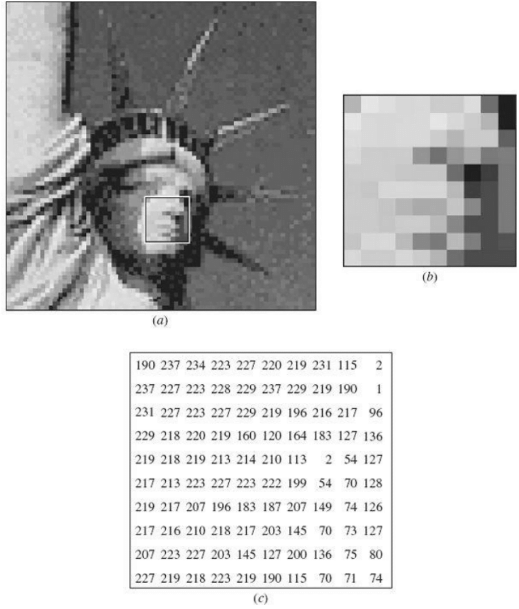]
]
---

# Digital Image Representation and Resolution
.pull-left[
- Computers use pixel values from 0 to 255 because an 8-bit binary number can store 256 possible values.
- Digital images are created by sampling small areas called pixels, where each pixel records the light energy from part of the object.
- Smaller pixels provide higher geometric (spatial) resolution, resulting in clearer and more recognizable images.

***

The binary image requires only 1 bit of computer memory for each pixel ($2^1$ = 2), the 4-level image requires 2 bits ($2^2$ = 4), and the 8-level image requires 3 bits ($2^3$ = 8).
]
.pull-right[
.center[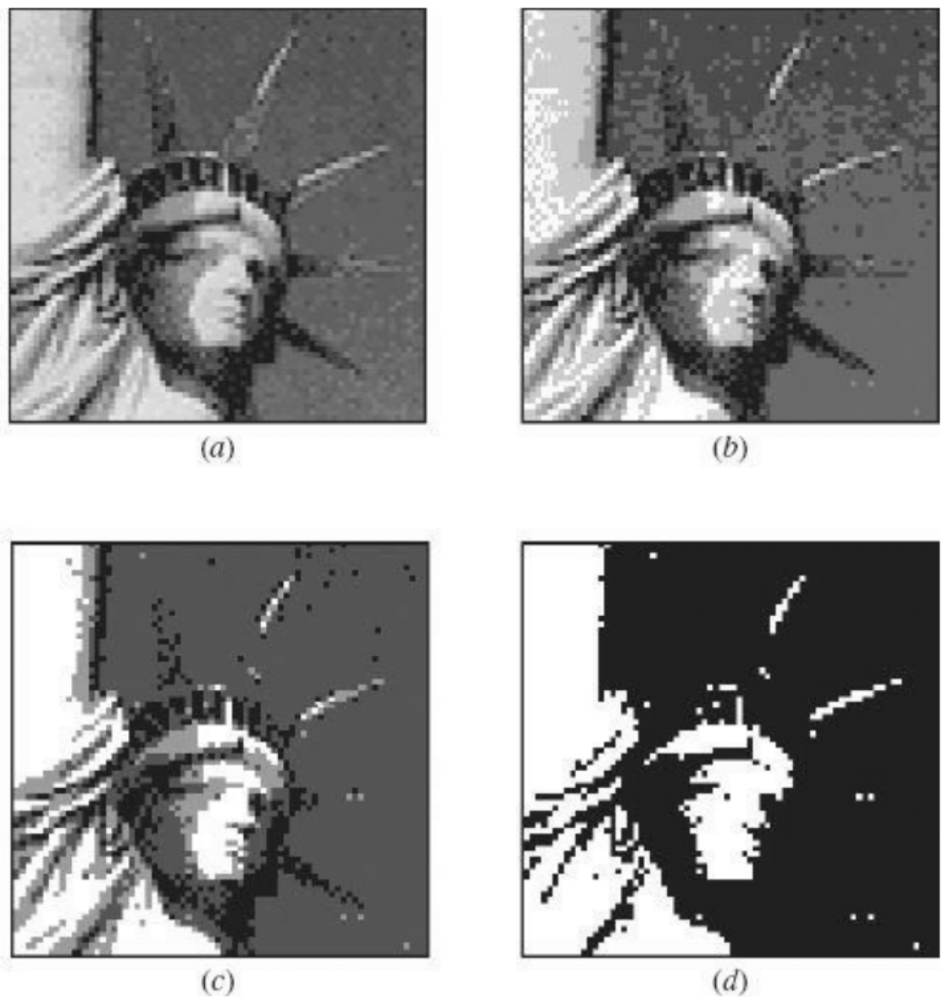]

]
---
.f3.orange.b[Question?] A 3000-row by 3000-column satellite image has three spectral channels. If each pixel is represented by 8 bits (1 byte) per channel, how many bytes of computer memory are required to store the image?

--

For a satellite image:
* Rows = 3000
* Columns = 3000
* Spectral channels = 3
* Storage per pixel per channel = 1 byte

Total storage:
$3000 \times 3000 \times 3 \times 1$
$= 27{,}000{,}000 \text{ bytes}$

So, the image requires:

* **27,000,000 bytes**
* Approximately **27 MB** (decimal system)

---

## Homework: Numerical Problem: Digital Image Data Volume

A multispectral satellite image covers an area of 60 km $\times$ 60 km with a spatial resolution of 20 m. The image contains 3 spectral bands, and each pixel is stored using 8 bits (1 byte) per band.

1. Calculate the number of pixels in the image.
2. Calculate the total storage required in bytes.
3. Convert the storage into megabytes (MB).

Additionally, a panchromatic image of the same area has a spatial resolution of 10 m with only one spectral band stored at 8 bits per pixel.

4. Calculate the storage required for the panchromatic image.
5. If the multispectral image were also stored at 10 m resolution, determine the new storage requirement.

---
.b.f3["Photogrammetry works like the human eye. Humans use two eyes to perceive depth, while photogrammetry uses two overlapping images to calculate depth mathematically."]

.center[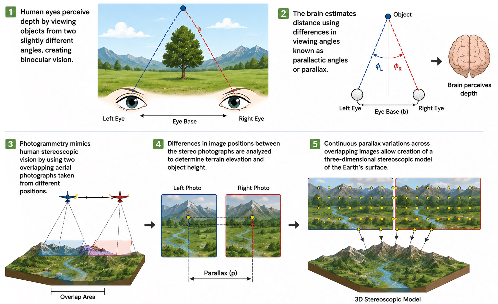]

.footnote[Image Source: AI Generated]
---

# Flight planning in drone photogrammetry
Flight planning in drone photogrammetry refers to the process of designing and organizing a UAV survey.

The primary purpose of flight planning is to obtain high-quality overlapping images that can be processed into accurate orthomosaics, Digital Elevation Models (DEMs), and three-dimensional terrain models.

Key components of flight planning include:

- Flight altitude,
- Ground Sampling Distance (GSD),
- Forward and side overlap,
- Camera orientation,
- Flight speed,
- Battery and mission duration,
- Terrain following strategy,
- Weather and illumination conditions.

---
# Forward and side overlap
.pl-60[
.center[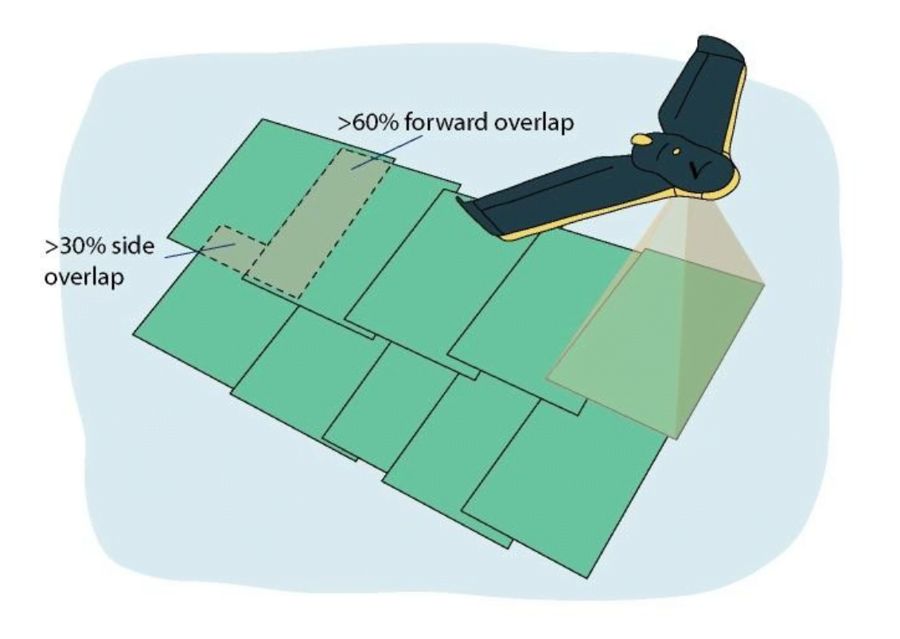]
]
.pr-40[
To produce accurate terrain models, a minimum forward overlap of 60 percent and a minimum side overlap of 30 percent are recommended

This is intended for:
- traditional stereophotogrammetry,
- aerial terrain mapping,
- DEM/DTM generation using frame cameras,
- adequate stereo coverage and parallax geometry.
]
---

# Ground Sampling Distance (GSD)
A fundamental parameter in drone photogrammetry that defines the spatial resolution of an image.
- It represents the actual ground distance covered by a single pixel in the captured imagery, typically expressed in centimeters per pixel (cm/pixel).
- Lower GSD values indicate higher spatial resolution and finer terrain detail.
In UAV-based mapping, GSD depends on flight altitude, camera sensor size, focal length, and image dimensions.

The relationship is commonly expressed as:

$$GSD = \frac{H \times S_w}{f \times I_w}$$

where:

* $H$ = flight height above ground,
* $S_w$ = sensor width,
* $f$ = focal length,
* $I_w$ = image width in pixels.

In practice, UAV surveys for topographic mapping commonly target GSD values between 1-5 cm/pixel depending on the required positional accuracy and terrain complexity.
---

## QGIS: An Open-Source GIS Platform for Mapping and Spatial Data Processing
.pull-left[
QGIS supports the viewing, editing, visualization, printing, and analysis of geospatial data. It is widely used in environmental studies, hydrology, remote sensing, and drone-based spatial analysis due to its extensive analytical capabilities and open-source ecosystem.

### Applications of QGIS include:

- Hydrological Modeling
- Spatial Analysis of Water Features
- Water Quality Monitoring
- Drought Analysis
- Drone Data Processing and Orthomosaic Generation
- Digital Elevation Model (DEM) Analysis
- Land Use and Land Cover (LULC) Mapping
- Watershed Delineation and Terrain Analysis
- Remote Sensing and Satellite Image Processing
- Geospatial Data Visualization and Cartography
]
.pull-right[
  .center[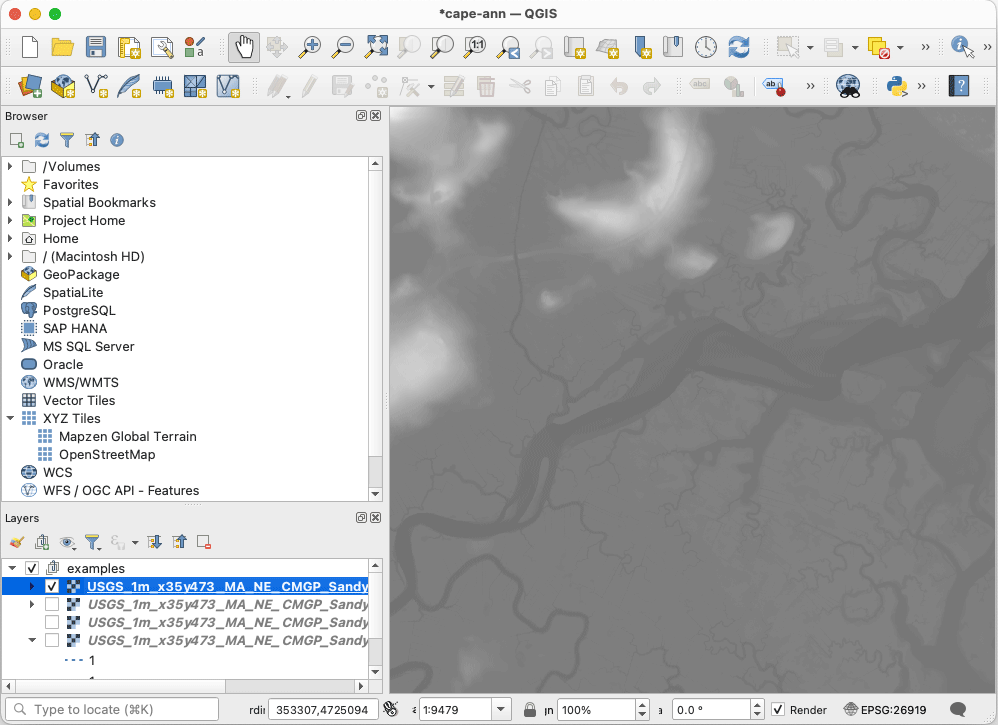]

  .footnote[Image Source: [beautifulpublicdata.com](https://www.beautifulpublicdata.com/visualizing-rivers-and-floodplains/)]
]

---
# QGIS for flight planning
.center[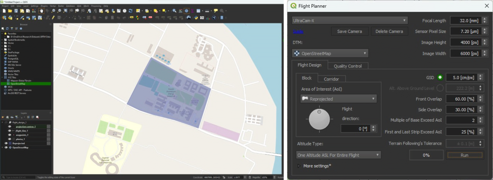]
---

# Flight Planning in QGIS
.pl-70[
.center[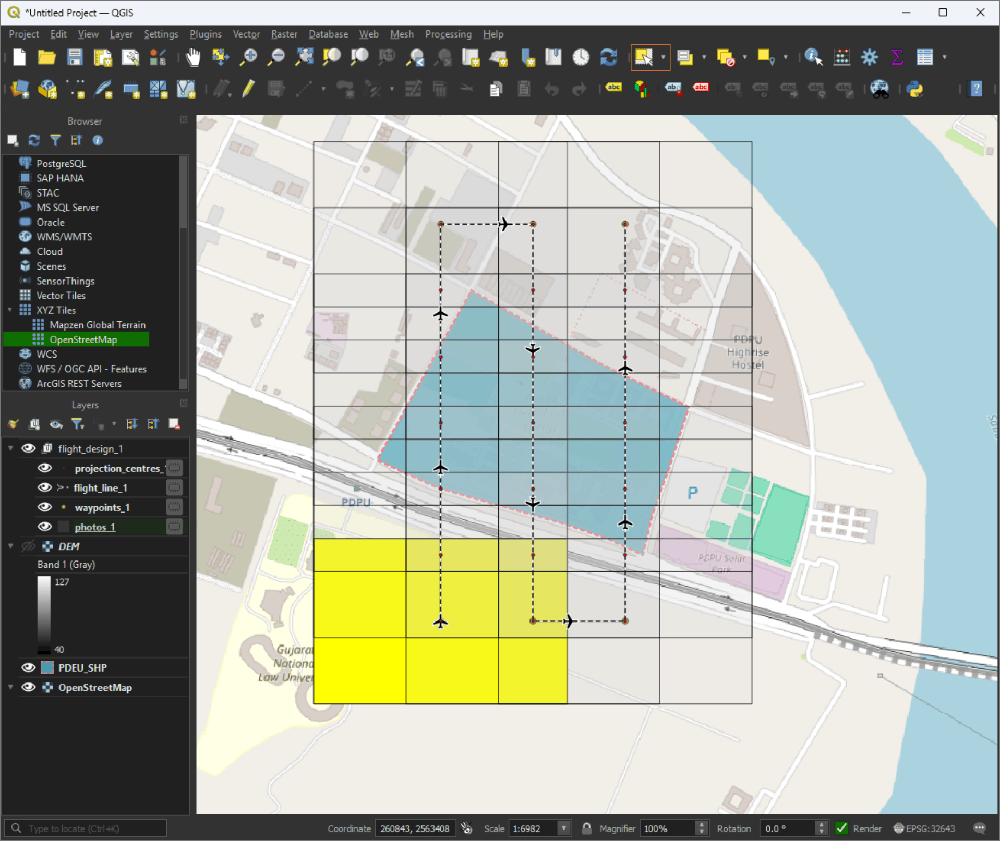]
]
.pr-30[
.f3[Typical Workflow After Drone Flight Completion]
1. Data Transfer and Backup: After completion of the drone mission we collect all the data using USB.
2. Image Quality Inspection: heck for blurred, overexposed, or missing images.
3. Import Data into Photogrammetry Software: Pix4D or OpenDroneMap.
4. Ground Control Point (GCP) Integration: Import surveyed GCP coordinates.
5. Dense Point Cloud Generation.
6. DEM and DSM Creation.
]
