<style>
body { font-size: 15px; line-height: 1.7; }
.keybox   { border-left: 6px solid #d79921; background: #f7ecc8; padding: 12px 16px; margin: 14px 0; border-radius: 5px; }
.civilbox { border-left: 6px solid #458588; background: #e0e8e6; padding: 12px 16px; margin: 14px 0; border-radius: 5px; }
.warnbox  { border-left: 6px solid #cc241d; background: #f6ddd6; padding: 12px 16px; margin: 14px 0; border-radius: 5px; }
.tipbox   { border-left: 6px solid #98971a; background: #e8eac9; padding: 12px 16px; margin: 14px 0; border-radius: 5px; }
.readbox  { border-left: 6px solid #8e44ad; background: #ece0f2; padding: 12px 16px; margin: 14px 0; border-radius: 5px; }
</style>

```{r setup, include=FALSE}
knitr::opts_chunk$set(
  echo        = FALSE,
  message     = FALSE,
  warning     = FALSE,
  fig.width   = 7.5,
  fig.height  = 4.5,
  fig.align   = "center",
  dev         = "pdf",
  tidy        = FALSE
)
```

```{r packages}
# ggplot2 is available for any plots that may be added later.
if (!requireNamespace("ggplot2", quietly = TRUE)) {
  install.packages("ggplot2", repos = "https://cloud.r-project.org")
}
library(ggplot2)
```


\newpage
# Engineering the Future with Intelligence

> *"Engineering the future with intelligence -- data-driven, model-powered, ethically grounded."*

This unit introduces the foundations of Artificial Intelligence (AI) as it applies to Civil Engineering. You will move from the vocabulary of intelligence and machine learning, through the historical and philosophical roots of AI, and finally into the modern practice of data-driven decision-making on construction sites, in water resources, and across critical infrastructure. The tools are general; the problems are the ones you will meet on site.

::: {.civilbox}
**Civil connection:** Every concept in this unit is illustrated with a civil engineering example -- concrete strength, urban floods, rainfall, pavement condition, bridge inspection, groundwater, and public water supply. AI is presented not as a black box, but as an **engineering problem-solving tool** that sits alongside analytical and empirical models.
:::

---

# Outline of Unit - I

The unit is organised so that each section builds on the previous one. By the end, you will move from *what AI is* to *how it is used responsibly in civil engineering*.

::: {.keybox}
**Topics covered in this unit:**

1. AI Fundamentals & Engineering Context
2. Introduction to AI -- Definition, Scope of Machine Learning vs. Deep Learning
3. Data Science Lifecycle and Workflow
4. Narrow AI vs. Generative AI, Foundation Models and Large Language Models (LLMs)
5. Core Learning Paradigms -- Supervised, Unsupervised, Reinforcement Learning
6. Civil Engineering Applications
7. Ethical AI -- Bias Mitigation, Explainable AI (XAI), Data Privacy in Public Works
:::

The figure below (from [xkcd #1838](https://xkcd.com/1838/)) is a friendly reminder of what happens when we apply machine learning without thinking about the problem first.

```{r xkcd, echo=FALSE, out.width="60%"}
knitr::include_graphics("images/u1/machine_learning.png")
```

---

# Unit Objectives & Roadmap

## What You Will Learn

- Understand AI fundamentals in an **engineering context**.
- Differentiate ML, DL, Narrow AI, Generative AI, Foundation Models, LLMs.
- Master the **Data Science Lifecycle**.
- Explore civil, water resources, and geospatial applications.
- Recognise the ethical imperatives -- bias, explainability, privacy.

```{r roadmap-img, echo=FALSE, out.height="100%"}
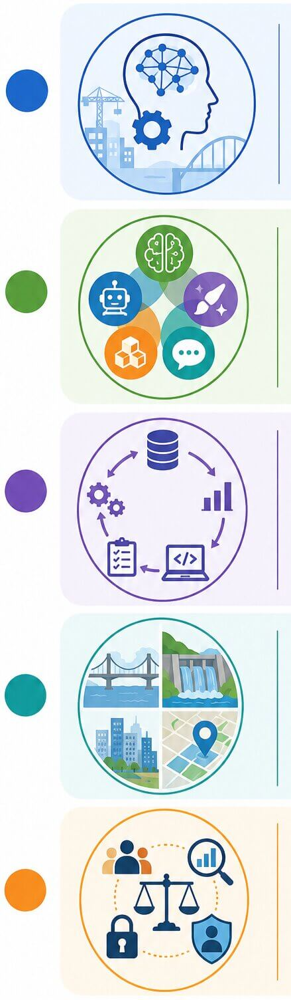
```

## AI Fundamentals in an Engineering Context

- Go beyond generic definitions -- frame AI as an **engineering problem-solving tool**.
- Understand the shift from empirical / analytical models to **data-driven decision-making**.

## Differentiate Core AI Paradigms & Modern Models

- **ML vs. DL:** Understand feature engineering (ML) vs. automatic hierarchical feature extraction (DL).

---

# Defining Intelligence

- **Alan Turing** proposed the *Turing Test* to determine whether a machine can demonstrate human-like intelligence.
- The original idea mainly focused on a machine's ability to perform logical and mathematical reasoning.
- Today, intelligence is recognised as a combination of multiple abilities, including logical, emotional, artistic, sensory, and reflective intelligence.
- A truly human-level AI would need to demonstrate many forms of intelligence rather than excelling in only one.

```{r ent-img, echo=FALSE, out.width="40%"}
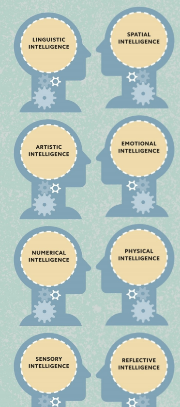
```

---

# What is Artificial Intelligence?

> *"The science and engineering of making intelligent machines."*
> --- John McCarthy, 1956

- Artificial intelligence (AI) is intelligence demonstrated by machines, which in turn are known as "AIs".
- The history of AI dates back to the 1950s, when the first modern computers were built.
- Today, machine learning -- the use of large data sets to train AI models, such as artificial neural networks, to perform tasks without being explicitly programmed to do so -- dominates AI research.
- In popular culture, AIs are often depicted as rivals of human intelligence, or even as an existential threat.
- In reality, AI technologies tend to be limited in their applications, a long way from reaching the intelligence of a cat, let alone a human being.
- However, AI is a powerful tool when applied to specific problems, such as reading handwriting, recommending TV shows, or diagnosing medical conditions.

```{r ai-rev-img, echo=FALSE, out.width="45%"}
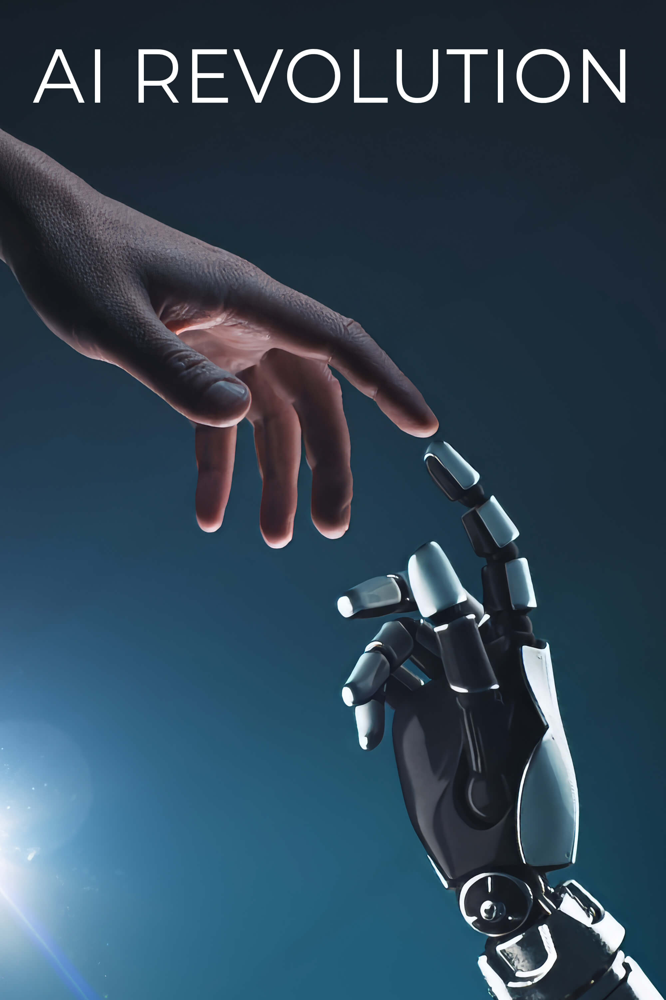
```

---

# Acting Humanly: The Turing Test Approach

::: {.tipbox}
The Turing test, proposed by **Alan Turing (1950)**, was designed as a thought experiment that would sidestep the philosophical vagueness of the question *"Can a machine think?"*
:::

A computer passes the test if a human interrogator, after posing some written questions, cannot tell whether the written responses come from a person or from a computer.

To pass this test, a computer would need the following capabilities:

- **Natural language processing** -- to communicate successfully in a human language.
- **Knowledge representation** -- to store what it knows or hears.
- **Automated reasoning** -- to answer questions and to draw new conclusions.
- **Machine learning** -- to adapt to new circumstances and to detect and extrapolate patterns.

---

# Thinking = Computing

- The idea that all thinking, whether human or artificial, is a form of **computing** -- specifically, a process of using algorithms to convert symbolic inputs into symbolic outputs -- is known as *computationalism*.
- Computationalists argue that the human brain is a computer, and that one day an AI should therefore be able to do anything that a brain can do. In other words, they claim, such an AI would not merely **simulate** thinking -- it would have genuine, humanlike consciousness.

```{r thinking-img, echo=FALSE, out.width="45%"}
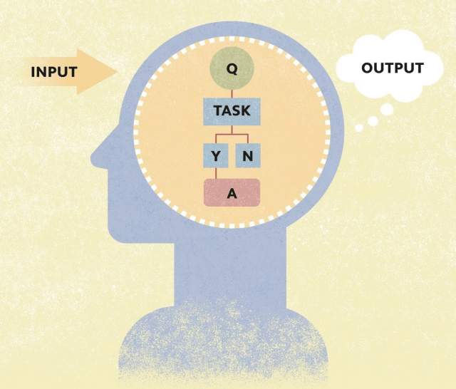
```

---

# The First Mechanical Computer

- Humans make mistakes, so **Charles Babbage (1791--1871)** invented what he called the *Difference Engine* -- a machine that could perform mathematical calculations mechanically.
- Babbage then designed the *Analytical Engine* -- a general-purpose calculator that could be programmed using punched cards, and had separate memory and processing units.

```{r machine-img, echo=FALSE, out.width="55%"}
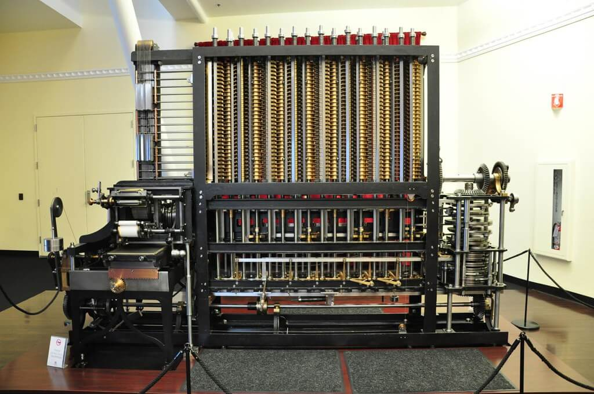
```

::: {.readbox}
Image source: <https://www.flickr.com/photos/cheryl_hill/8267467136/>
:::

---

# An Electric Brain

- **Alan Turing** had shown that a machine could carry out any computation with the right combination of symbols.
- In **1943**, scientist **Walter McCulloch (1898--1969)** and mathematician **Walter Pitts (1923--69)** demonstrated that networks of units based on human nerve cells, or neurons, passing electric signals back and forth, could copy a Turing machine.
- The brain might be a kind of living computer, meaning that a program that ran on the human brain might also run on an electric brain. This theory is known as the principle of **multiple realizability**.

```{r brain-img, echo=FALSE, out.width="45%"}
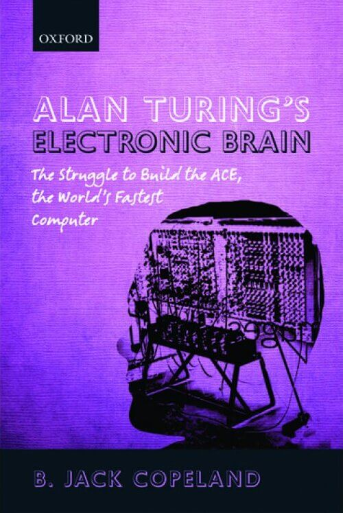
```

---

# Artificial Neurons

- Each of the **86 billion neurons** in the human brain is effectively a tiny processor, receiving electrical signals (inputs) from other neurons and sending out signals of its own (outputs).
- A neuron works by first adding the values of its inputs (signals from other neurons) and then multiplying that value by a variable ("weight").
- If the input signals exceed a certain value, the neuron is triggered to send an output signal. This triggering is called the **activation function**.

```{r neuron-img, echo=FALSE, out.width="70%"}
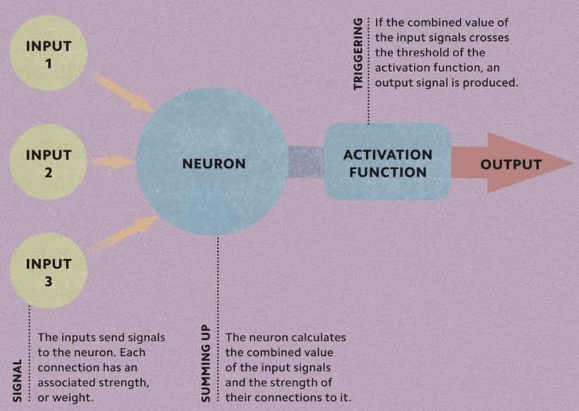
```

---

# A Computing Blueprint

- **Von Neumann Architecture** is the basic design used by most modern computers. It was introduced by **John von Neumann** and defines how a computer's main components work together.
- **Memory stores both programs and data**, allowing computers to execute instructions faster and making them much easier to update or reprogram than earlier machines.
- **The CPU (Central Processing Unit)** controls all operations. The **Control Unit (CU)** reads and interprets instructions, while the **Arithmetic Logic Unit (ALU)** performs calculations and logical operations, then stores the results back in memory.

```{r bp-img, echo=FALSE, out.width="55%"}
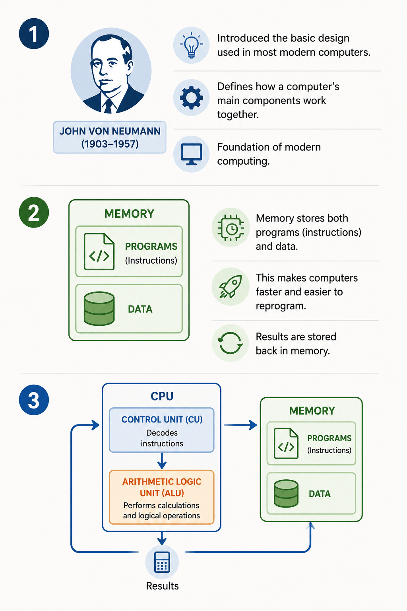
```

::: {.readbox}
Image source: ChatGPT | Book: *Simply Artificial Intelligence*.
:::

---

# Computing Power

- **Moore's Law** is named after **Gordon Moore (1929--)**, the cofounder of integrated-circuit chip-maker Intel.
- In **1965**, Moore predicted that the number of transistors that could be fitted onto a computer chip would double every two years.
- Due to advances in technology, particularly miniaturization, this prediction was borne out for decades, and although it has since slowed down, computing power is still increasing each year.
- This means that in the foreseeable future, if computationalism is correct, AIs will have the same amount of computing power as the human brain.

```{r moore-img, echo=FALSE, out.width="60%"}
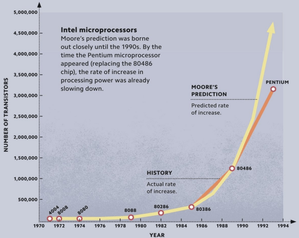
```

---

# AI -- ML -- DL

::: {.keybox}
**John McCarthy (1956) -- as the founder of AI:**

> "The science and engineering of making intelligent machines, especially intelligent computer programs."

**Arthur Samuel (1959) -- one of the earliest formal definitions:**

> "Machine learning is the field of study that gives computers the ability to learn without being explicitly programmed."

**Ian Goodfellow, Yoshua Bengio, and Aaron Courville (2016) -- from the standard textbook *Deep Learning*:**

> "Deep learning is a particular kind of machine learning that achieves great power and flexibility by learning to represent the world as a nested hierarchy of concepts."
:::

```{r aiml-img, echo=FALSE, out.width="55%"}
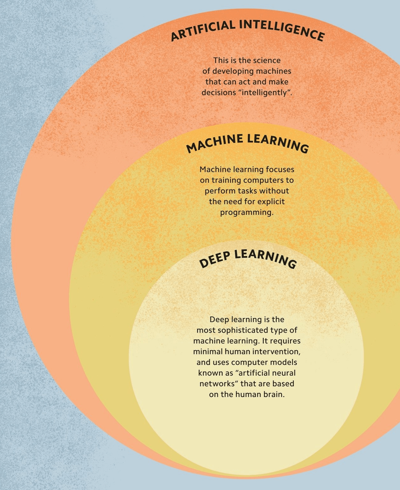
```

---

# Narrow AI vs. Generative AI

| **Narrow AI (Traditional AI)**                      | **Generative AI**                                     |
| --------------------------------------------------- | ----------------------------------------------------- |
| Designed for a **specific task**                    | Creates **new content** from learned patterns         |
| Uses predefined rules or trained models             | Uses large foundation models (LLMs, diffusion models) |
| Produces predictions, classifications, or decisions | Generates text, images, audio, video, and code        |
| Limited to its trained application                  | Can perform a wide range of creative tasks            |
| - Spam email filtering                              | - ChatGPT (text generation)                           |
| - Face recognition                                  | - DALL.E (image generation)                           |
| - Netflix recommendation system                     | - GitHub Copilot (code generation)                    |
| - Self-driving lane detection                       | - Suno (music generation)                             |

::: {.civilbox}
**Narrow AI**
`Input -> AI Model -> Prediction / Decision (Classify, Detect, Recommend)`

**Generative AI**
`Prompt -> AI Model -> New Content (Text, Image, Code, Audio)`
:::

---

# Foundation Models and Large Language Models (LLMs)

- **Foundation Models** are large, reusable AI models trained on broad data. Examples: GPT-4 / GPT-5 (OpenAI), Gemini (Google), Llama (Meta), Claude (Anthropic), Mistral (Mistral AI).
- **Large Language Models (LLMs)** are a specialized category of Foundation Models designed to understand and generate human language. Examples: ChatGPT (GPT-4/GPT-5), Gemini, Claude, Llama 3, DeepSeek, Mistral.

| **Foundation Model**                       | **Large Language Model (LLM)**         |
| ------------------------------------------ | -------------------------------------- |
| General-purpose AI model                   | A Foundation Model focused on language |
| Can process text, images, audio, and video | Primarily processes and generates text |
| Supports multiple AI applications          | Specializes in NLP tasks               |
| Example: Gemini, GPT-4o                    | Example: GPT-5, Llama 3, Claude        |

```{r ai-img, echo=FALSE, out.width="60%"}
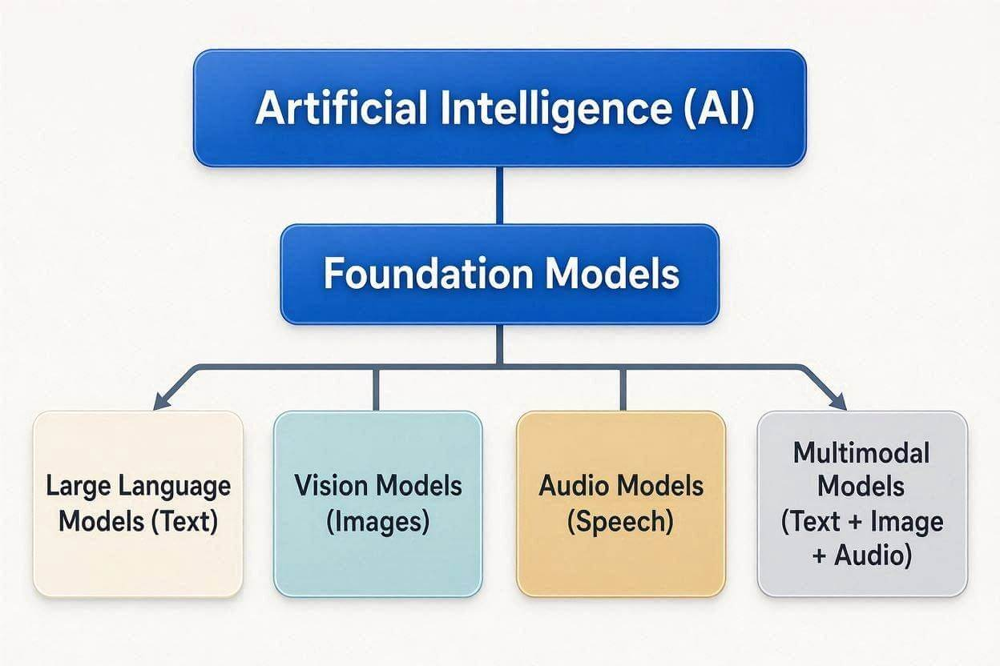
```

---

# Core Learning Paradigms

## Supervised Learning

- Learns from **labeled data** (input + correct output).
- Goal is to predict the correct output for new data.
- Common tasks: **Classification** and **Regression** (e.g., email spam detection).

## Unsupervised Learning

- Learns from **unlabeled data** (no correct answers provided).
- Goal is to discover hidden patterns or groups in the data.
- Common tasks: **Clustering**, **Dimensionality Reduction** (e.g., customer segmentation).

## Reinforcement Learning

- An **agent** learns by interacting with an **environment**.
- Receives **rewards** for good actions and **penalties** for poor actions.
- Goal is to maximize the total reward over time (e.g., self-driving cars).

::: {.civilbox}
```
Supervised Learning
Labeled Data -> Train Model -> Predict Output

Unsupervised Learning
Unlabeled Data -> Discover Patterns -> Groups/Clusters

Reinforcement Learning
Environment -> Agent -> Action -> Reward -> Learn Better Policy
```
:::

```{r corel-img, echo=FALSE, out.width="60%"}
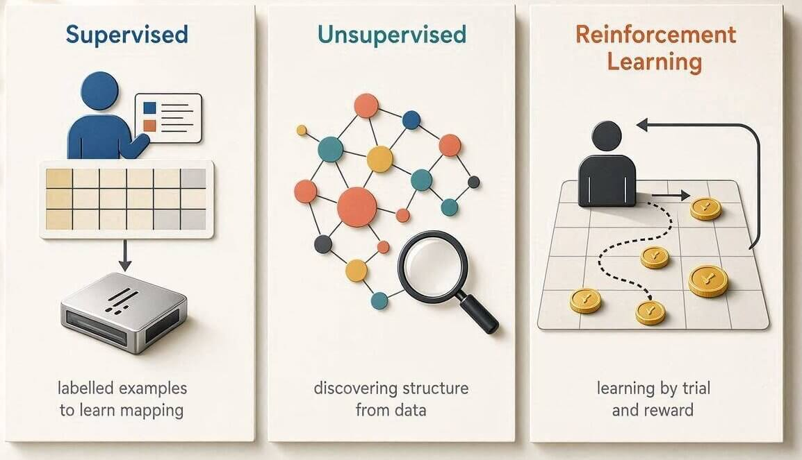
```

---

# The Foundations of Artificial Intelligence: Philosophy

- How does the mind arise from a physical brain?
- Where does knowledge come from?
- How does knowledge lead to action?

::: {.keybox}
**Aristotle (384--322 BCE)** was the first to formulate a precise set of laws governing the rational part of the mind. He developed an informal system of **syllogisms** for proper reasoning, which in principle allowed one to generate conclusions mechanically, given initial premises.
:::

::: {.tipbox}
In his 1651 book *Leviathan*, **Thomas Hobbes (1588--1679)** suggested the idea of a thinking machine, an "artificial animal" in his words, arguing *"For what is the heart but a spring; and the nerves, but so many strings; and the joints, but so many wheels."*
:::

::: {.readbox}
**René Descartes (1596--1650)** gave the first clear discussion of the distinction between mind and matter. He noted that a purely physical conception of the mind seems to leave little room for free will. If the mind is governed entirely by physical laws, then it has no more free will than a rock "deciding" to fall downward.
:::

---

# The Foundations of Artificial Intelligence: Philosophy (cont.)

- **David Hume's (1711--1776)** *A Treatise of Human Nature* (1739) proposed what is now known as the principle of **induction** -- that general rules are acquired by exposure to repeated associations between their elements.
- Building on the work of **Ludwig Wittgenstein (1889--1951)** and **Bertrand Russell (1872--1970)**, the famous **Vienna Circle**, a group of philosophers and mathematicians meeting in Vienna in the 1920s and 1930s, developed the doctrine of **logical positivism**.
- This doctrine holds that all knowledge can be characterized by logical theories connected, ultimately, to observation sentences that correspond to sensory inputs; thus logical positivism combines rationalism and empiricism.
- In matters of ethics and public policy, a decision maker must consider the interests of multiple individuals. **Jeremy Bentham (1823)** and **John Stuart Mill (1863)** promoted the idea of **utilitarianism**: that rational decision making based on maximizing utility should apply to all spheres of human activity, including public policy decisions.
- In contrast, **Immanuel Kant** in 1875 proposed a theory of rule-based or **deontological ethics**, in which "doing the right thing" is determined not by outcomes but by universal social laws that govern allowable actions, such as "don't lie" or "don't kill."

---

# The Foundations of Artificial Intelligence: Mathematics

- What are the formal rules to draw valid conclusions?
- What can be computed?
- How do we reason with uncertain information?

::: {.keybox}
- **Logic:** Provides formal rules for reasoning and drawing valid conclusions (Boolean Logic and First-Order Logic).
- **Probability & Statistics:** Help AI make decisions under uncertainty and learn from data using methods such as Bayes' theorem.
- **Algorithms & Computation:** Define step-by-step procedures for solving problems and determine what computers can compute.
- **Computational Complexity:** Evaluates whether problems can be solved efficiently, highlighting challenges such as intractable and NP-complete problems.
:::

---

# The History of Artificial Intelligence

## The Inception of Artificial Intelligence (1943--1956)

- **1943 -- McCulloch & Pitts:** Proposed the first artificial neuron model, showing that networks of neurons could perform logical operations (AND, OR, NOT) and compute functions.
- **1949 -- Hebbian Learning:** Donald Hebb introduced the Hebbian learning rule ("neurons that fire together, wire together"), forming the basis of neural network learning.
- **1950 -- First Neural Network Computer:** Marvin Minsky and Dean Edmonds built SNARC, the first neural network machine, simulating 40 artificial neurons.
- **1950 -- Alan Turing:** Introduced the Turing Test and proposed that machines could learn through experience instead of explicit programming.
- **1956 -- Dartmouth Conference:** John McCarthy organized the Dartmouth Workshop, where the term **Artificial Intelligence (AI)** was officially introduced as a research field.
- **Logic Theorist (1956):** Allen Newell and Herbert Simon developed the Logic Theorist, the first AI program capable of proving mathematical theorems, demonstrating symbolic reasoning.

---

# The History of Artificial Intelligence

## Early Enthusiasm, Great Expectations (1952--1969)

- **1950s -- Early AI Successes:** AI researchers demonstrated that computers could solve games, puzzles, mathematics, and logic problems, challenging the belief that machines could never "think."
- **General Problem Solver (GPS):** Allen Newell and Herbert Simon developed GPS, one of the first AI systems designed to imitate human problem-solving.
- **Arthur Samuel's Checkers Program:** Introduced reinforcement learning, enabling a computer to improve its gameplay through experience rather than explicit programming.
- **1958 -- Lisp Programming Language:** John McCarthy created Lisp, the dominant programming language for AI research for several decades.
- **Knowledge Representation:** McCarthy's Advice Taker introduced the idea that AI should represent knowledge explicitly and reason logically to solve problems.
- **Perceptrons (1962):** Frank Rosenblatt introduced the Perceptron, an early neural network capable of learning from examples, laying the foundation for modern deep learning.

---

# The History of Artificial Intelligence

## Expert Systems (1969--1986)

- AI shifted from **general problem-solving** to **domain-specific knowledge**, leading to more practical and accurate systems.
- **DENDRAL (1969):** The first successful **expert system**, used specialized rules to identify **molecular structures** from mass spectrometry data.
- **MYCIN (1970s):** A medical expert system that diagnosed **blood infections** using hundreds of expert-defined rules and **certainty factors** to handle uncertainty.
- **Commercial Success:** Systems like **R1** at Digital Equipment Corporation automated computer configuration, saving millions of dollars and driving widespread industry adoption.
- **Knowledge Representation:** AI introduced techniques such as **frames, Prolog, and rule-based reasoning** to represent and process expert knowledge.
- **AI Boom and AI Winter:** Rapid growth in the 1980s was followed by the **AI Winter**, as expert systems proved expensive to maintain, could not learn from experience, and often failed to meet expectations.

---

# The History of Artificial Intelligence

## The Return of Neural Networks and Machine Learning (1986--Present)

- **Revival of Neural Networks (1980s):** The backpropagation algorithm enabled neural networks to learn from data, renewing interest in AI and laying the foundation for modern deep learning.
- **Shift to Machine Learning:** AI moved from hand-coded rules to data-driven learning, allowing systems to improve performance through training examples.
- **Probabilistic AI:** Researchers adopted probability and statistics (e.g., Bayesian Networks) to handle uncertainty more effectively than rule-based expert systems.
- **Reinforcement Learning:** Rich Sutton connected reinforcement learning with Markov Decision Processes (MDPs), providing a strong mathematical framework for sequential decision-making.
- **Benchmark Datasets:** Standard datasets (e.g., MNIST, ImageNet, COCO) became the basis for objectively comparing AI algorithms and measuring progress.
- **Integration with Other Fields:** AI increasingly combined statistics, optimization, control theory, and machine learning, leading to major advances in computer vision, speech recognition, robotics, and natural language processing.

---

# The History of Artificial Intelligence

## Big Data (2001--Present)

- **Rise of Big Data:** The growth of the Internet, World Wide Web, and cloud computing created massive datasets of text, images, videos, speech, and sensor data.
- **Data-Driven AI:** AI systems achieved better performance by learning from millions or billions of examples rather than relying on handcrafted rules.
- **Importance of Large Datasets:** Studies showed that more data often improves accuracy more than more complex algorithms.
- **ImageNet Revolution:** The release of the ImageNet dataset transformed computer vision by providing millions of labeled images for training AI models.
- **Commercial Success:** Big data enabled practical AI applications, including IBM Watson's 2011 *Jeopardy!* victory, which renewed public and industrial interest in AI.

---

# The History of Artificial Intelligence

## Deep Learning (2011--Present)

- **Deep Learning:** Uses **multi-layer neural networks** to automatically learn complex patterns from large datasets.
- **Breakthrough in 2012:** AlexNet, developed by Geoffrey Hinton's team, achieved a **major improvement in the ImageNet competition**, marking the start of the deep learning era.
- **Wide Applications:** Deep learning now powers **computer vision, speech recognition, machine translation, medical diagnosis, and game-playing AI** (e.g., AlphaGo).
- **Requires Powerful Hardware:** Training deep learning models depends on **GPUs, TPUs, and large-scale parallel computing**.
- **Modern AI Foundation:** The combination of **big data, deep learning, and high-performance computing** has driven today's rapid advances in Artificial Intelligence.

---

# AI in Civil Engineering Applications

## Pavement Deterioration Analysis & Concrete Strength Prediction

- **YOLOv8 + SAM** model detects and segments asphalt deterioration types from road images with **99.4% mAP@50** accuracy.
- Automates **Pavement Condition Index (PCI)** calculation -- traditionally manual, slow, and costly.
- Enables real-time defect recognition via vehicle-mounted or drone-based imaging systems.
- **XAI frameworks** integrating clustering and PCA provide interpretable insights into root causes of pavement distress.

## Non-Destructive Testing Powered by AI

- **Hybrid deep learning framework** uses microstructural images to predict compressive strength -- **87% $R^2$** with 20% lower error than traditional methods.
- Combines **CAE** for feature extraction (80% dimensionality reduction), **Transformer attention** for interpretability, and **LSTM** to capture curing evolution.
- **Stacking ensemble models** (Random Forest, XGBoost, Bi-LSTM) achieve $R^2 = 0.9676$ for sustainable concrete with industrial waste.
- **SHAP analysis** reveals how cement, fly ash, and slag interact to influence strength.

---

# AI in Civil Engineering Applications (cont.)

## Traffic Flow Forecasting

- **LSTM, GRU, and Conv1D-LSTM** models predict short-term traffic flow on roadways.
- **Empirical Mode Decomposition (EMD)** preprocesses non-stationary traffic data to remove noise and outliers.
- EMD-preprocessed **LSTM** achieves RMSE of 23.18 and MAPE of 8.55% -- outperforming standalone models.
- AI/ML techniques (CNNs, LSTMs, SVMs, PINNs) are transforming transportation systems management.

::: {.civilbox}
**Benefit:** Enables adaptive traffic management, congestion mitigation, and data-driven urban planning.
:::

## Structural Health Monitoring (SHM)

- **Real-Time Anomaly Detection for Critical Infrastructure.**
- **TinyML-enabled SHM** performs edge computing on low-power devices -- **92% accuracy** with 40% less energy than traditional systems.
- Integrates accelerometers, strain gauges, and environmental sensors for continuous vibration, deformation, and temperature/humidity data.

::: {.civilbox}
**Benefit:** Decentralized, real-time decisions without cloud dependency -- ideal for aging infrastructure and remote locations.
:::

---

# AI in Civil Engineering Applications (cont.)

## Bridge Inspection Automation

- **Computer Vision + Semantic Analysis for Defect Detection.**
- **YOLOv10**-based models detect bridge defects from limited, low-quality image datasets.
- **Graph Neural Networks** model multi-factor coupling relationships to interpret root causes of defects.
- **YOLOv7** achieves **87.64% mAP** for automated crack detection, integrated with BIM systems.
- **Human-AI collaboration** allows inspectors to review and correct outputs at each stage.

::: {.civilbox}
**Benefit:** Faster, more consistent inspections; reduced surveyor burden; objective, traceable assessments of large bridge portfolios.
:::

## Construction Safety Systems

- **Vision-Based Real-Time Safety Monitoring.**
- Real-time alerts via Telegram and automated weekly safety reports.
- **YOLOv12** and semi-supervised learning approaches further advance automated **PPE violation detection**.

::: {.civilbox}
**Benefit:** Continuous, automated monitoring replaces slow manual inspections -- catches safety violations in real time, preventing accidents before they happen.
:::

---

# AI in Water Resources Engineering

## Flood Forecasting

- Predict flood occurrence and water levels using rainfall, river discharge, and weather data.
- Enables early warning systems and emergency planning.

## Rainfall Prediction

- Forecast short-term and seasonal rainfall using historical observations and satellite data.
- Supports reservoir operation and agricultural planning.

## Drought Monitoring

- Detect drought conditions by integrating rainfall, vegetation, soil moisture, and temperature.
- Helps assess drought severity and improve water management.

## Groundwater Modeling

- Estimate groundwater levels and recharge using hydrogeological and climate data.
- Assists sustainable groundwater extraction and resource planning.

```{r river-img, echo=FALSE, out.width="45%"}

```

---

# Ethical AI: Why It Matters in Civil Engineering

> **Building AI Systems that are Fair, Transparent, and Trustworthy.**

### Why Ethics Matters

- AI increasingly supports engineering decisions rather than simply automating calculations.
- Incorrect AI predictions may lead to unsafe designs, unfair resource allocation, or financial losses.
- Engineers remain responsible for decisions, even when AI provides recommendations.
- Ethical AI ensures technology benefits society while minimizing unintended harm.

| Application                | Ethical Concern                                        |
| -------------------------- | ------------------------------------------------------ |
| Flood forecasting          | False alarms or missed warnings                        |
| Road inspection            | Missing damage in low-quality images                   |
| Water distribution         | Unequal water allocation                               |
| Infrastructure maintenance | Prioritizing wealthy areas over vulnerable communities |

::: {.tipbox}
**Takeaway:** AI should support engineers -- not replace engineering judgment.
:::

---

# Bias Mitigation & Explainable AI (XAI)

::: {.warnbox}
**AI is only as good as its data.**
:::

### What is AI Bias?

Bias occurs when training data do not adequately represent real-world conditions.

**Examples:**

- Flood prediction trained only on **urban watersheds** performs poorly in **rural regions**.
- Pavement crack detector trained on **daylight images** struggles **at night**.
- Landslide model developed in **one climate** may fail **elsewhere**.

### Bias Mitigation

- Use **diverse and representative** datasets.
- Balance training samples across regions and conditions.
- Validate models on **independent datasets**.
- Continuously **monitor** model performance after deployment.

---

# Explainable AI (XAI)

> **Traditional AI:** "Flood probability = 92%"

> **Explainable AI:** "High flood probability because rainfall increased 250%, soil moisture is already saturated, river discharge is rising, and elevation is low."

### Popular XAI Techniques

- Feature Importance
- **SHAP** (Shapley Additive Explanations)
- **LIME** (Local Interpretable Model-agnostic Explanations)
- Partial Dependence Plots

### Why XAI Matters

- Builds **trust**.
- Helps identify **model errors**.
- Supports **regulatory compliance**.
- Enables engineers to **verify AI recommendations**.

---

# Data Privacy in Public Works

## Responsible Use of Infrastructure Data

**What data do public agencies collect?**

- Drone imagery and CCTV footage
- GPS trajectories and smart traffic sensors
- Utility network data and mobile location data

## Best Practices

- Collect only **necessary** data.
- Remove personally identifiable information (**anonymization**).
- **Encrypt** sensitive datasets.
- Control **user access**.
- Follow **national data protection regulations**.
- Maintain **audit logs** for AI decisions.

## Ethical AI Checklist for Engineers

**Before deploying an AI model, ask:**

- Is the dataset **representative**?
- Has the model been **independently validated**?
- Can the prediction be **explained**?
- Is **personal data protected**?
- Will a **human review** important decisions?

::: {.keybox}
**Key Message**

> **Responsible AI = Accurate AI + Fair AI + Explainable AI + Secure Data.**
:::

---

# Resources and References

1. Boehmke, B., & Greenwell, B. M. (2019). *Hands-On Machine Learning with R*. CRC Press.
2. DK. (2023). *Simply Artificial Intelligence* (First American edition). DK.
3. James, G., Witten, D., Hastie, T., & Tibshirani, R. (2021). *An Introduction to Statistical Learning: with Applications in R* (Second edition). Springer.
4. Russell, S. J., & Norvig, P. (2021). *Artificial Intelligence: A Modern Approach* (Fourth edition). Pearson.
5. [Setting Up Local Large Language Models on Windows](https://ankitdeshmukh.com/post/2025-02-07-running-llm-locally-setting-up-deepseek-r1/)
