class: center middle inverse

```{r setup, include=FALSE}
options(htmltools.dir.version = FALSE)
knitr::opts_chunk$set(
  out.width = "100%",
  cache = FALSE,
  echo = TRUE,
  message = FALSE,
  warning = FALSE,
  fig.show = TRUE,
  hiline = TRUE,
  results = "asis"
)
```

<style> .title-slide { background-image: url("./images/u1/Background-01.png"); } </style>

```{r, echo=FALSE, include=TRUE}
if (!require(xaringan)) {
  install.packages("xaringan")
  library(xaringan)
}
if (!require(xaringanExtra)) {
  install.packages("xaringanExtra")
  library(xaringanExtra)
}

use_logo(image_url = "./css/Anix-Logo.png", link_url = "https://www.ankitdeshmukh.com/", width = "40px", height = "40px")
use_progress_bar(color = "#00a008", location = "top", height = "0.25em")
use_extra_styles(hover_code_line = TRUE, mute_unhighlighted_code = FALSE)
use_xaringan_extra(c("tile_view", "tachyons", "use_logo", "use_progress_bar"))
```

.f2.gold["Engineering the future with intelligence -- data-driven, model-powered, ethically grounded."]

---
class: left top inverse

# .gold[Outline of Unit - 1]

.pull-left[
.center[]
.footnote[.white[source: ]https://xkcd.com/1838/]

]

.pull-right[
- **AI Fundamentals** & Engineering Context
- Introduction to AI (Definition, Scope of ML vs. Deep Learning)
- **Data Science Lifecycle** and Workflow
- Narrow AI vs. Generative AI, Foundation Models and Large Language Models (LLMs)
- Core Learning Paradigms (Supervised, Unsupervised, Reinforcement Learning)
- **Civil Engineering Applications**
- Ethical AI (Bias Mitigation, Explainable AI/XAI, Data Privacy in Public Works)
]

---

# Unit Objectives & Roadmap
.pl-30[
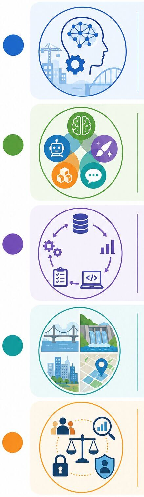
]
.pr-70[
## What You Will Learn
- Understand AI fundamentals in an engineering context
- Differentiate ML, DL, Narrow AI, Generative AI, Foundation Models, LLMs
- Master the **Data Science Lifecycle**
- Explore civil, water resources, and geospatial applications
- Recognize ethical imperatives: **bias, explainability, privacy**

### AI Fundamentals in an Engineering Context
- Go beyond generic definitions—frame AI as an **engineering problem-solving tool**.
- Understand the shift from empirical/analytical models to **data-driven decision-making**.

### Differentiate Core AI Paradigms & Modern Models
- **ML vs. DL:** Understand feature engineering (ML) vs. automatic hierarchical feature extraction (DL).
]

---

# Defining Intelligence
.pl-70[
- **Alan Turing** proposed the **Turing Test** to determine whether a machine can demonstrate **human-like intelligence**.
- Early ideas focused on a machine's ability to perform **logical and mathematical reasoning**.
- Today, intelligence is recognized as a combination of multiple abilities, including logical, emotional, artistic, sensory, and reflective intelligence.
- A truly **human-level AI** would need to demonstrate many forms of intelligence rather than excelling in only one.
]
.pr-30[
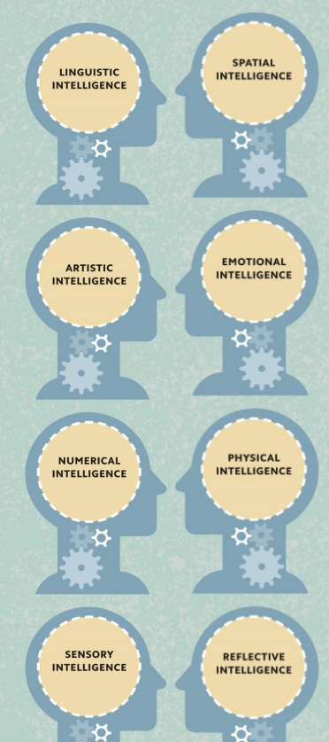
]

---

.pl-60[
# What is Artificial Intelligence?

> "The science and engineering of making intelligent machines." -- **John McCarthy, 1956**

- Artificial intelligence (AI) is **intelligence demonstrated by machines**.
- .blue[The history of AI dates back to the **1950s**, when the first modern computers were built.]
- Today, **machine learning**—the use of large data sets to train AI models without being explicitly programmed—dominates AI research.
- .blue[In popular culture, AIs are often depicted as rivals to human intelligence.]
- In reality, AI technologies tend to be limited in their applications, far from reaching the intelligence of a cat, let alone a human being.
- .blue[However, AI is a **powerful tool** when applied to specific problems, such as reading handwriting, recommending TV shows, or diagnosing medical conditions.]
]

.pr-40[
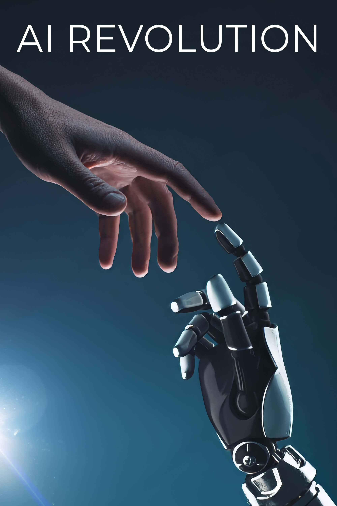
]

---

# Acting humanly: The Turing test approach
.co-tip[The **Turing test**, proposed by Alan Turing (1950), was designed as a thought experiment to sidestep the question "Can a machine think?"]

A computer passes the test if a human interrogator, after posing written questions, cannot tell if the responses come from a person or a computer.

To pass, a computer needs the following capabilities:
- **Natural language processing** to communicate successfully in a human language.
- **Knowledge representation** to store what it knows or hears.
- **Automated reasoning** to answer questions and draw new conclusions.
- **Machine learning** to adapt to new circumstances and detect patterns.

---

# THINKING = COMPUTING
.pl-40[
- The idea that all thinking is a form of computing (using algorithms to convert symbolic inputs into outputs) is known as **"computationalism."**
- Computationalists argue that the **human brain is a computer**, and one day an AI should be able to do anything a brain can do.
- They claim such an AI would not merely simulate thinking—it would have genuine, **humanlike consciousness**.
]
.pr-60[
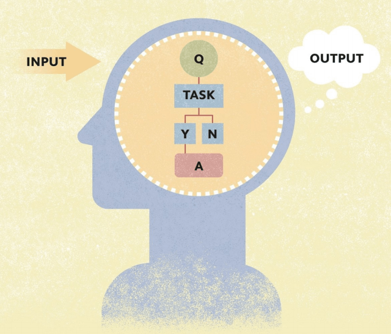
]

---

# The Foundations of Artificial Intelligence: Philosophy
- How does the mind arise from a physical brain?
- Where does knowledge come from?
- How does knowledge lead to action?

.co-imp[**Aristotle (384-322 BCE)** was the first to formulate precise laws governing the rational part of the mind. He developed an informal system of **syllogisms** for proper reasoning, allowing one to generate conclusions mechanically from initial premises.]

.co-note[In his 1651 book *Leviathan*, **Thomas Hobbes (1588-1679)** suggested the idea of a thinking machine, an "artificial animal," arguing that the heart is but a spring, and the nerves but strings.]

.co-tip[**René Descartes (1596-1650)** gave the first clear discussion of the distinction between **mind and matter**. He noted that a purely physical conception of the mind leaves little room for **free will**.]

---

# The Foundations of Artificial Intelligence: Philosophy (cont.)
- **David Hume (1711-1776)** proposed the principle of **Induction**: general rules are acquired by exposure to repeated associations between their elements.
- The **Vienna Circle** (1920s-30s) developed **logical positivism**, combining rationalism and empiricism. This holds that all knowledge can be characterized by logical theories connected to observation sentences (sensory inputs).
- In ethics and public policy, **Jeremy Bentham (1823)** and **John Stuart Mill (1863)** promoted **utilitarianism**: rational decision-making based on maximizing utility for all spheres of human activity.
- In contrast, **Immanuel Kant** proposed **deontological ethics** (rule-based ethics), where "doing the right thing" is determined by universal social laws (e.g., "don't lie"), not by outcomes.

---

# The Foundations of Artificial Intelligence: Mathematics
- What are the formal rules to draw valid conclusions?
- What can be computed?
- How do we reason with uncertain information?

.co-imp[
- **Logic:** Provides formal rules for reasoning (Boolean Logic and First-Order Logic).
- **Probability & Statistics:** Helps AI make decisions under uncertainty and learn from data (e.g., Bayes' theorem).
- **Algorithms & Computation:** Define step-by-step procedures for solving problems and determine what computers can compute.
- **Computational Complexity:** Evaluates whether problems can be solved efficiently, highlighting challenges like NP-complete problems.
]

---

# The first mechanical computer
.pl-40[
- Humans make mistakes, so **Charles Babbage (1791-1871)** invented the **"Difference Engine"**—a machine that could perform mathematical calculations mechanically.
- Babbage then designed the **"Analytical Engine"**—a general-purpose calculator programmed using punched cards, with separate **memory and processing units**.
]
.pr-60[
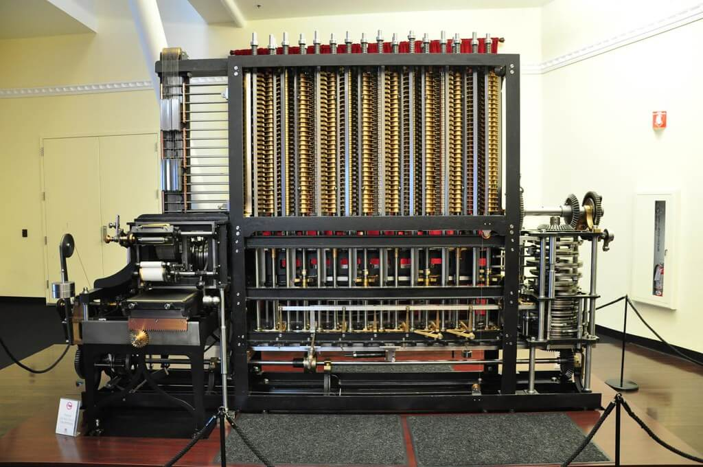
]
.footnote[Image source: https://www.flickr.com/photos/cheryl_hill/8267467136/]

---

# A computing blueprint
.pull-left[
- **Von Neumann Architecture** is the basic design used by most modern computers, introduced by **John von Neumann**.
- **Memory stores both programs and data**, allowing computers to execute instructions faster and making them easier to reprogram.
- The **CPU (Central Processing Unit)** controls all operations:
  - The **Control Unit (CU)** reads and interprets instructions.
  - The **Arithmetic Logic Unit (ALU)** performs calculations and logical operations, storing results back in memory.

.footnote[Image Source: ChatGPT | Book: Simply Artificial Intelligence]
]
.pull-right[
 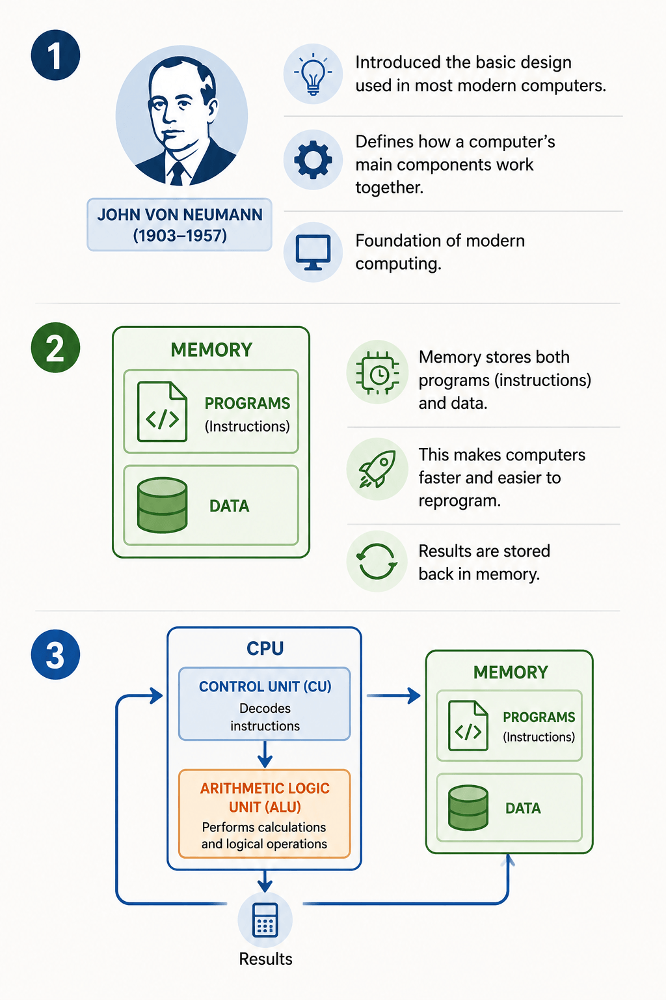
]

---

# Computing Power
.pl-40[
- **Moore's Law**, named after Intel co-founder **Gordon Moore**.
- In 1965, Moore predicted that the number of **transistors** on a computer chip would **double every two years**.
- Due to miniaturization, this prediction held true for decades. Though growth has slowed, computing power continues to increase.
- If computationalism is correct, AI will soon have the same computing power as the **human brain**.
]
.pr-60[
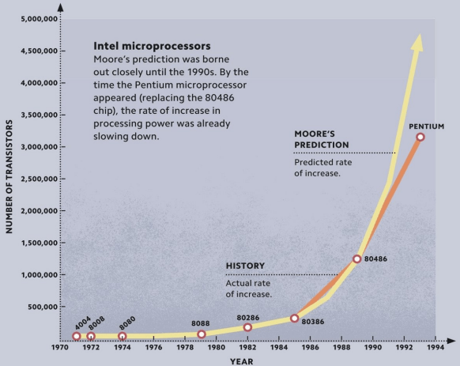
]

---

.pl-60[
# An Electric Brain
- **Alan Turing** showed that a machine could carry out any computation with the right combination of symbols.
- In 1943, **Walter McCulloch** and **Walter Pitts** demonstrated that networks of artificial **neurons** passing electric signals could copy a Turing machine.
- The brain might be a kind of living computer. This theory is known as the principle of **"multiple realizability"**.
]

.pr-40[
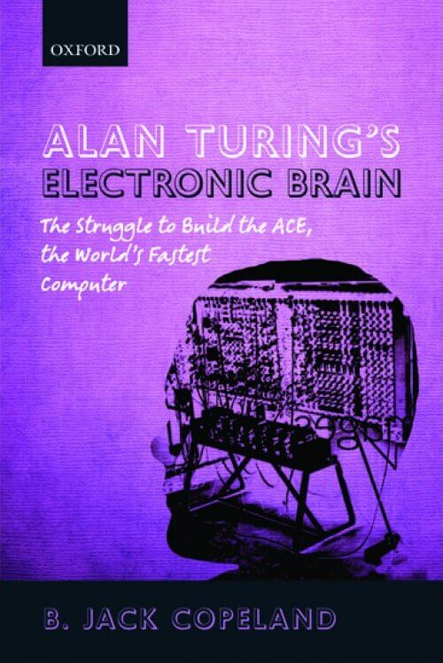
]

---

# Artificial Neurons
.pl-30[
The human brain has **86 billion neurons**. Each is a tiny processor, receiving electrical signals (**inputs**) and sending out signals (**outputs**).

- A neuron works by adding the values of its inputs and multiplying it by a **"weight"**.
- If the input signals exceed a certain value, the neuron fires an output.
- This triggering mechanism is called the **"activation function"**.
]
.pr-70[
   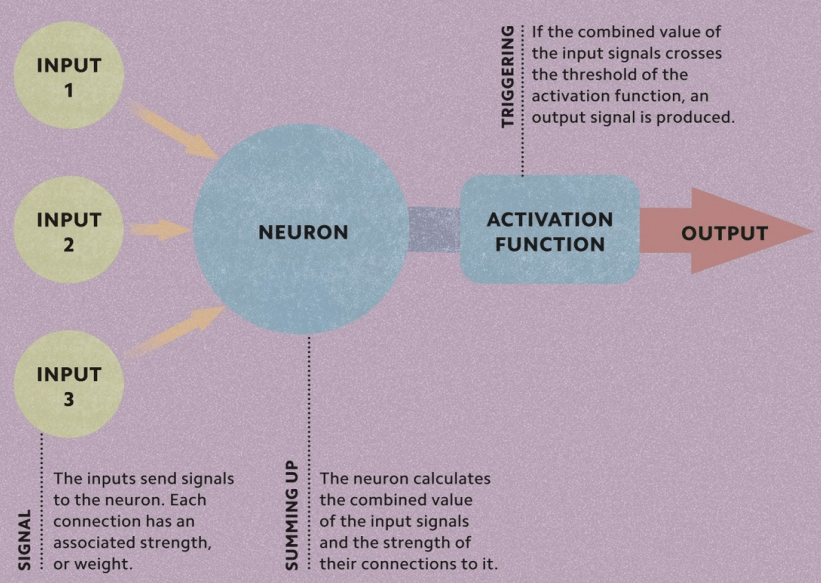
]

---

# The History of Artificial Intelligence
## The inception of AI (1943-1956)
- **1943 - McCulloch & Pitts:** Proposed the first artificial neuron model, showing networks could perform logical operations (AND, OR, NOT).
- **1949 - Hebbian Learning:** Donald Hebb introduced the rule ("neurons that fire together, wire together"), forming the basis of neural network learning.
- **1950 - First Neural Network Computer:** Marvin Minsky and Dean Edmonds built SNARC, simulating 40 artificial neurons.
- **1950 - Alan Turing:** Introduced the Turing Test and proposed that machines could learn through experience.
- **1956 - Dartmouth Conference:** John McCarthy organized the workshop where the term **Artificial Intelligence (AI)** was officially introduced.
- **1956 - Logic Theorist:** Newell and Simon developed the first AI program capable of proving mathematical theorems.

---
# The History of Artificial Intelligence
## Early enthusiasm & great expectations (1952-1969)
- **1950s - Early AI Successes:** Computers solved games, puzzles, and logic problems, challenging the belief that machines could never "think."
- **General Problem Solver (GPS):** Newell and Simon developed GPS to imitate human problem-solving.
- **Arthur Samuel's Checkers Program:** Introduced **reinforcement learning**, allowing computers to improve through experience.
- **1958 - Lisp Programming Language:** John McCarthy created Lisp, the dominant AI language for decades.
- **Knowledge Representation:** McCarthy's Advice Taker introduced the idea that AI should represent knowledge explicitly.
- **1962 - Perceptrons:** Frank Rosenblatt introduced the Perceptron, an early neural network capable of learning from examples, laying the foundation for modern deep learning.

---
# The History of Artificial Intelligence
## Expert systems (1969-1986)
- AI shifted from general problem-solving to **domain-specific knowledge**.
- **DENDRAL (1969):** The first successful expert system, used specialized rules to identify molecular structures.
- **MYCIN (1970s):** Diagnosed blood infections using hundreds of expert-defined rules and **certainty factors**.
- **Commercial Success:** Systems like R1 automated computer configuration, saving millions and driving industry adoption.
- **AI Boom and AI Winter:** Rapid growth in the 1980s was followed by the **AI Winter**, as expert systems proved expensive to maintain, could not learn from experience, and failed to meet expectations.

---
# The History of Artificial Intelligence
## The return of neural networks & machine learning (1986-present)
- **Revival of Neural Networks (1980s):** The **backpropagation algorithm** enabled neural networks to learn from data, laying the foundation for modern deep learning.
- **Shift to Machine Learning:** AI moved from hand-coded rules to **data-driven learning**.
- **Probabilistic AI:** Researchers adopted probability and statistics (e.g., Bayesian Networks) to handle uncertainty.
- **Reinforcement Learning:** Rich Sutton connected RL with Markov Decision Processes (MDPs) for sequential decision-making.
- **Benchmark Datasets:** Standard datasets (MNIST, ImageNet, COCO) became the basis for measuring progress.
- **Integration with Other Fields:** AI combined statistics, optimization, and control theory, advancing computer vision, speech recognition, and NLP.

---
# The History of Artificial Intelligence
## Big Data (2001-Present)
- **Rise of Big Data:** The Internet and cloud computing created massive datasets of text, images, videos, and sensor data.
- **Data-Driven AI:** Systems achieved better performance by learning from millions of examples rather than relying on handcrafted rules.
- **Importance of Large Datasets:** Studies showed that more data often improves accuracy more than complex algorithms.
- **ImageNet Revolution:** The release of ImageNet transformed computer vision by providing millions of labeled images.
- **Commercial Success:** Big data enabled practical applications, including IBM Watson's 2011 Jeopardy! victory.

---
# The History of Artificial Intelligence
## Deep Learning (2011-Present)

* **Deep Learning:** Uses **multi-layer neural networks** to automatically learn complex patterns from large datasets.
* **Breakthrough in 2012:** AlexNet, developed by Geoffrey Hinton's team, achieved a major improvement in the ImageNet competition, marking the start of the deep learning era.
* **Wide Applications:** Powers computer vision, speech recognition, machine translation, medical diagnosis, and game-playing AI (e.g., AlphaGo).
* **Requires Powerful Hardware:** Training depends on **GPUs, TPUs, and large-scale parallel computing**.
* **Modern AI Foundation:** The combination of **big data, deep learning, and high-performance computing** drives today's rapid advances.

---
.pull-left[
# AI-ML-DL
**John McCarthy (1956) - Founder of AI:**
> "The science and engineering of making intelligent machines."

**Arthur Samuel (1959) - ML definition:**
> "Machine learning gives computers the ability to learn without being explicitly programmed."

**Goodfellow, Bengio, & Courville (2016) - Deep Learning:**
> "Deep learning achieves great power and flexibility by learning to represent the world as a nested hierarchy of concepts."
]
.pull-right[
 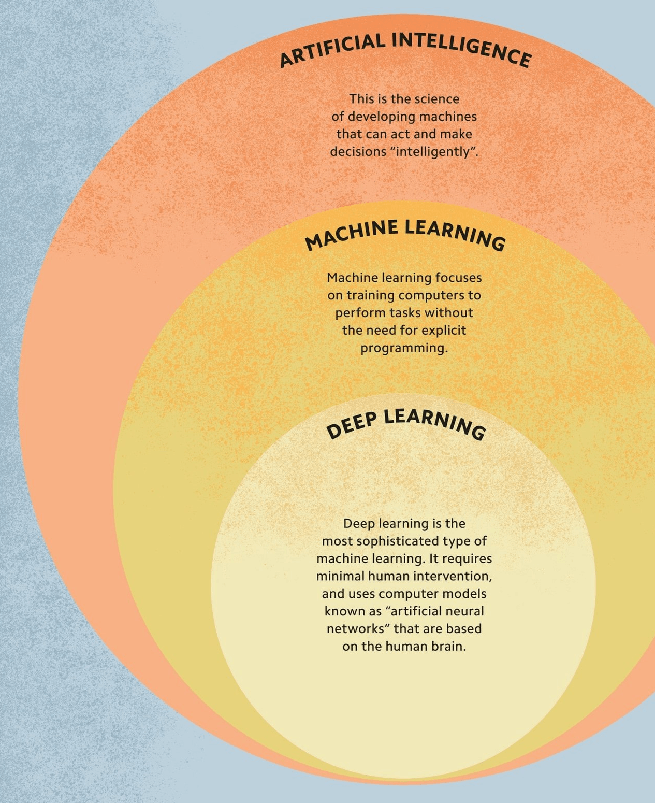
]

---
# Narrow AI vs. Generative AI
| **Narrow AI (Traditional AI)**                      | **Generative AI**                                     |
| --------------------------------------------------- | ----------------------------------------------------- |
| Designed for a **specific task**                    | Creates **new content** from learned patterns         |
| Uses predefined rules or trained models             | Uses large foundation models (LLMs, diffusion models) |
| Produces predictions, classifications, or decisions | Generates text, images, audio, video, and code        |
| Limited to its trained application                  | Can perform a wide range of creative tasks            |
| - Spam email filtering                              | - ChatGPT (text generation)                           |
| - Face recognition                                  | - DALL-E (image generation)                           |
| - Netflix recommendation system                     | - GitHub Copilot (code generation)                    |
| - Self-driving lane detection                       | - Suno (music generation)                             |

```
Narrow AI:   Input -> AI Model -> Prediction / Decision
Generative AI: Prompt -> AI Model -> New Content (Text, Image, Code)
```

---
# Foundation Models and Large Language Models (LLMs)
- **Foundation Models** are large, reusable AI models trained on broad data (e.g., GPT-4, Gemini, Llama, Claude, Mistral).
- **Large Language Models (LLMs)** are a specialized category of Foundation Models designed to understand and generate human language (e.g., ChatGPT, Llama 3, DeepSeek).

.pull-left[
| **Foundation Model**                       | **Large Language Model (LLM)**         |
| ------------------------------------------ | -------------------------------------- |
| General-purpose AI model                   | A Foundation Model focused on language |
| Can process text, images, audio, video     | Primarily processes and generates text |
| Supports multiple AI applications          | Specializes in NLP tasks               |
| Example: Gemini, GPT-4o                    | Example: GPT-5, Llama 3, Claude        |
]

.pull-right[
   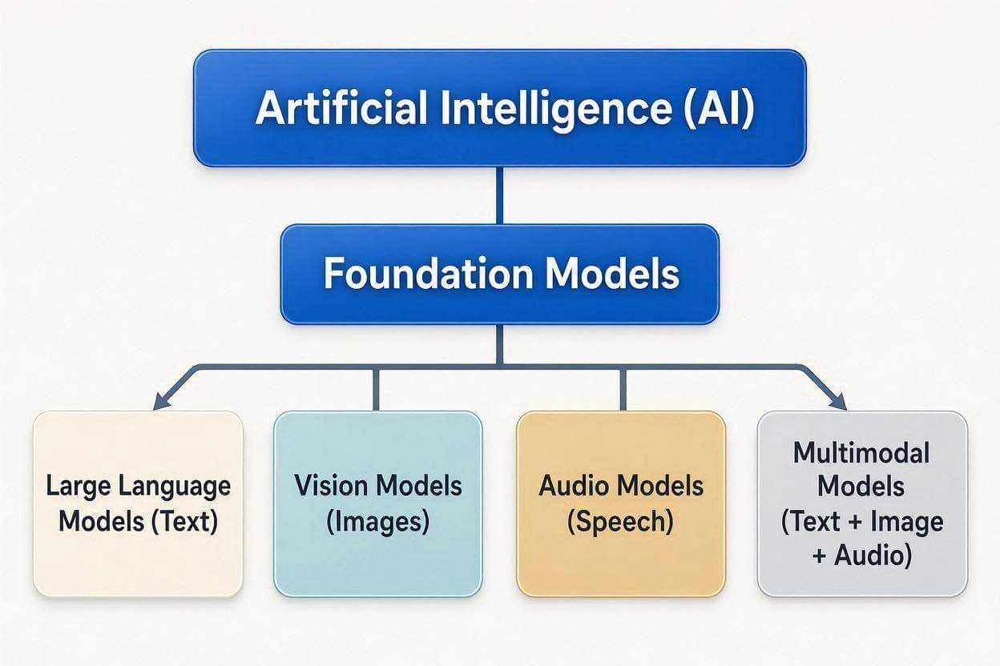
]

---
.pl-60[
# Core Learning Paradigms
## Supervised Learning
- Learns from **labeled data** (input + correct output).
- Goal is to predict outputs for new data.
- Tasks: **Classification** and **Regression** (e.g., Email spam detection).

## Unsupervised Learning
- Learns from **unlabeled data** (no correct answers provided).
- Goal is to discover hidden patterns or groups.
- Tasks: **Clustering**, Dimensionality Reduction (e.g., Customer segmentation).

## Reinforcement Learning
- An **agent** learns by interacting with an environment.
- Receives **rewards** for good actions and **penalties** for poor ones.
- Goal is to maximize total reward (e.g., Self-driving cars).
]
.pr-40[
   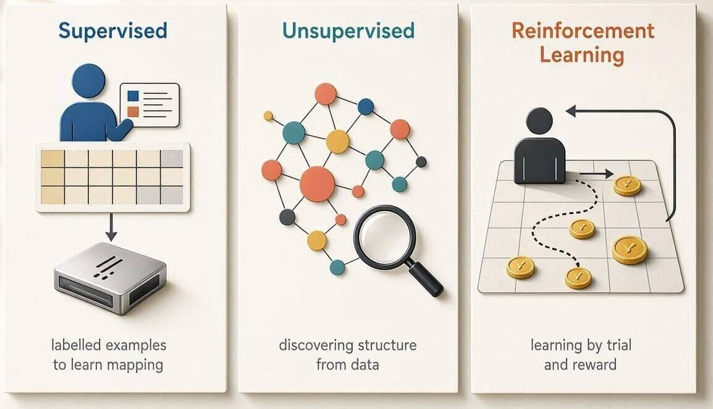

```text
Supervised Learning:    Labeled Data -> Train Model -> Predict Output
Unsupervised Learning:  Unlabeled Data -> Discover Patterns -> Clusters
Reinforcement Learning: Environment -> Agent -> Action -> Reward -> Learn Policy
```
]

---

# AI in Civil Engineering Applications
## Pavement Deterioration Analysis & Concrete Strength Prediction
- **YOLOv8 + SAM models** detect and segment asphalt deterioration from road images with **99.4% accuracy**.
- Automates **Pavement Condition Index (PCI)** calculation—traditionally manual, slow, and costly.
- Enables real-time defect recognition via vehicle-mounted or drone-based imaging.
- **XAI frameworks** integrating clustering and PCA provide interpretable insights into root causes of pavement distress.

## Non-Destructive Testing (NDT) Powered by AI
- Hybrid deep learning predicts compressive strength from microstructural images—**87% accuracy** with 20% lower error than traditional methods.
- Combines CAE for feature extraction, Transformer attention for interpretability, and LSTM to capture curing evolution.
- Stacking ensemble models (Random Forest, XGBoost, Bi-LSTM) achieve **R² = 0.9676** for sustainable concrete.
- **SHAP analysis** reveals how cement, fly ash, and slag interact to influence strength.

---
# AI in Civil Engineering Applications (cont.)
.blue[
## Traffic Flow Forecasting
- **LSTM, GRU, and Conv1D-LSTM** models predict short-term traffic flow.
- **Empirical Mode Decomposition (EMD)** preprocesses non-stationary traffic data to remove noise.
- EMD-preprocessed LSTM achieves **RMSE of 23.18** and **MAPE of 8.55%**, outperforming standalone models.
- AI/ML techniques are transforming transportation systems management.
> Benefit: Enables adaptive traffic management, congestion mitigation, and data-driven urban planning.
]

.red[
## Structural Health Monitoring (SHM)
- **TinyML-enabled SHM** performs edge computing on low-power devices—**92% accuracy** with 40% less energy.
- Integrates accelerometers, strain gauges, and environmental sensors for continuous vibration and deformation data.
> Benefit: Decentralized, real-time decisions without cloud dependency—ideal for aging infrastructure and remote locations.
]

---
# AI in Civil Engineering Applications (cont.)
## Bridge Inspection Automation
- **Computer Vision + Semantic Analysis** for Defect Detection.
- **YOLOv10-based models** detect bridge defects from limited, low-quality image datasets.
- **Graph Neural Networks** model multi-factor relationships to interpret root causes.
- **YOLOv7** achieves 87.64% mAP for automated crack detection, integrated with **BIM systems**.
- Human-AI collaboration allows inspectors to review and correct outputs.
> Benefit: Faster, more consistent inspections; reduced surveyor burden; objective, traceable assessments.

## Construction Safety Systems
- **Vision-Based Real-Time Safety Monitoring**.
- Real-time alerts via Telegram and automated weekly safety reports.
- **YOLOv12** and semi-supervised learning advance automated PPE violation detection.
> Benefit: Continuous monitoring replaces slow manual inspections—catches safety violations in real-time, preventing accidents.

---

.pl-70[
# AI in Water Resources Engineering
#### Flood Forecasting
  - Predict flood occurrence and water levels using rainfall, river discharge, and weather data.
  - Enables **early warning systems** and emergency planning.

#### Rainfall Prediction
- Forecast short-term and seasonal rainfall using historical observations and satellite data.
- Supports **reservoir operation** and agricultural planning.

#### Drought Monitoring
- Detect drought conditions by integrating rainfall, vegetation, soil moisture, and temperature.
- Helps assess drought severity and improve water management.

#### Groundwater Modeling
- Estimate groundwater levels and recharge using hydrogeological and climate data.
- Assists **sustainable groundwater extraction**.
]
.pr-30[

]

---

# Ethical AI: Why It Matters in Civil Engineering
> Building AI Systems that are **Fair, Transparent, and Trustworthy**

### Why ethics matters
- AI increasingly supports engineering decisions rather than simply automating calculations.
- Incorrect AI predictions may lead to **unsafe designs, unfair resource allocation, or financial losses**.
- Engineers remain responsible for decisions, even when AI provides recommendations.
- Ethical AI ensures technology benefits society while minimizing unintended harm.

| Application                | Ethical Concern                                        |
| -------------------------- | ------------------------------------------------------ |
| Flood forecasting          | False alarms or missed warnings                        |
| Road inspection            | Missing damage in low-quality images                   |
| Water distribution         | Unequal water allocation                               |
| Infrastructure maintenance | Prioritizing wealthy areas over vulnerable communities |

.co-tip[Takeaway: AI should **support engineers—not replace engineering judgment**.]

---
# Bias Mitigation & Explainable AI (XAI)
.co-warn[.center[AI is Only as Good as Its Data]]

### What is AI Bias:
Bias occurs when training data does not adequately represent real-world conditions.

**Examples:**
- Flood prediction trained only on urban watersheds performs poorly in rural regions.
- Pavement crack detector trained on daylight images struggles at night.
- Landslide model developed in one climate may fail elsewhere.

### Bias Mitigation
- Use **diverse and representative datasets**.
- Balance training samples across regions and conditions.
- Validate models on **independent datasets**.
- Continuously monitor model performance after deployment.

---

# Explainable AI (XAI)

> Traditional AI: **"Flood probability = 92%"**

> Explainable AI: **"High flood probability because rainfall increased 250%, soil moisture is saturated, river discharge is rising, and elevation is low."**

### Popular XAI Techniques
- **Feature Importance**
- **SHAP** (Shapley Additive Explanations)
- **LIME** (Local Interpretable Model-agnostic Explanations)
- **Partial Dependence Plots**

### Why XAI matters
- Builds **trust**
- Helps identify model errors
- Supports regulatory compliance
- Enables engineers to **verify AI recommendations**

---
# Data Privacy in Public Works
.pull-left[
## Responsible Use of Infrastructure Data
- What data do public agencies collect?
  - Drone imagery and CCTV footage
  - GPS trajectories, Smart traffic sensors
  - Utility network data, Mobile location data

## Best Practices
- Collect only necessary data.
- Remove personally identifiable information (**anonymization**).
- **Encrypt** sensitive datasets.
- Control user access.
- Follow national data protection regulations.
- Maintain **audit logs** for AI decisions.
]
.pull-right[
## Ethical AI Checklist for Engineers

### Before deploying an AI model, ask:
- Is the dataset representative?
- Has the model been independently validated?
- Can the prediction be explained?
- Is personal data protected?
- Will a human review important decisions?

### Key Message
> .b.center.orange[Responsible AI = Accurate AI + Fair AI + Explainable AI + Secure Data]
]

---
# Resources and References
1.  Boehmke, B., & Greenwell, B. M. (2019). *Hands-On Machine Learning with R*. CRC Press.
2.  DK. (2023). *Simply Artificial Intelligence* (First American edition). DK.
3.  James, G., Witten, D., Hastie, T., & Tibshirani, R. (2021). *An Introduction to Statistical Learning: with Applications in R* (Second edition). Springer.
4.  Russell, S. J., & Norvig, P. (2021). *Artificial Intelligence: A Modern Approach* (Fourth edition). Pearson.
5. [Setting Up Local Large Language Models on Windows](https://ankitdeshmukh.com/post/2025-02-07-running-llm-locally-setting-up-deepseek-r1/)
